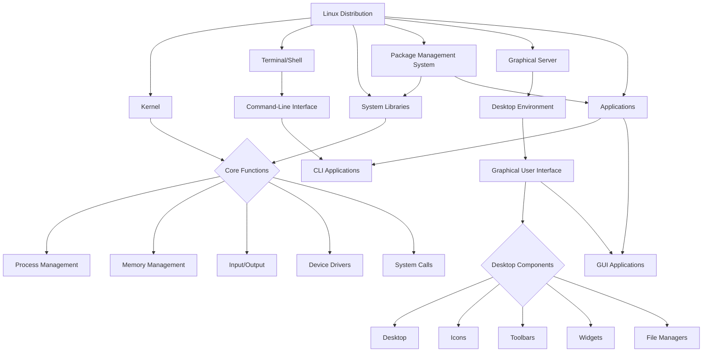
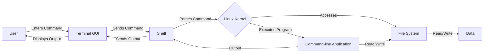
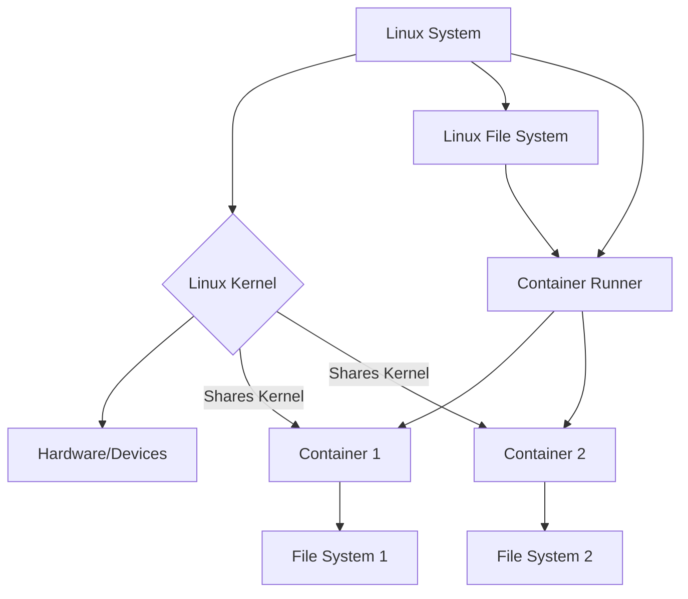

# 1. Thinking like a (Linux) engineer

> The first exercise will focus on the component-based mindset in engineering
> and security testing, and getting started with Linux operating system, with
> cyber security flavour.

An in-depth understanding of the high-level architectures, relationships, key
technologies, and interoperability of digital systems is one essential skill
when working with cyber security. These systems can be large and complex and be
very difficult to understand; the diversity of technology stacks and protocols,
the integration of legacy and new systems, and the ever-evolving nature of the
technology, with constantly evolving new cyber threats. What if there are issues
in the system? How could we identify, observe, solve, or even prevent them?
Especially in the context of security?

Usually, when we work with complex systems, we use the phrase "thinking like an
engineer" to describe the approach to handling possible problem situations. This
method usually involves _logical and critical thinking, creativity, and a
systematic evidence-based approach to problem-solving_. We divide the complex
problem _into smaller, more manageable problems_.

The idea of division is not only limited to engineering; it might be better
known as philosophical ideology _reductionism_[^1]. Reductive thinking is
popular in **game theory** as well; can you solve the more complex case if you
cannot solve the simpler case?

If we exclude human error, the security itself is usually built upon _both
design and implementation correctness._ It is fundamentally constructed on the
creation phase of the design and implementation, and not as an afterthought or a
separate process. Do not buy the snake oil.

Typically when we design and implement software and overall system, we
prioritize verifying that it does what we want, but we pay less attention to
other scenarios. These other scenarios are the regular root cause for the
security issues.

- We like to validate scenarios that support the intended use case and goals of
  the software.
  - Validating is usually known as conformance testing [^6]
  - Finite cases to validate
- But how about the rest? How does it function in non-valid cases? Are there any
  unintentional use cases for the software that we did not originally think of?
  - Usually known as negative testing [^7]
  - We cannot guarantee correctness at 100% level. When validating software, we
    have finite possibilities, but on the other hand, we might have **unlimited
    possibilities** to use the software incorrectly.
  - Fuzz testing [^11], formal verification [^12] and DevSecOps strategies [^13][^14][^15][^16]
    for example, try to push the boundaries to get closer to total security.
- Our software application takes integers as input. What happens if we give a
  letter 'Ä' for it? What if it isn't designed to handle it?
- What if the GUI button is pressed twice when only one is required for the
  intended use case?
- What if the software is supposed to take 20 characters of ASCII text, but
  there is no validation for the size, and deep underneath the software, the
  extra input data flows into the wrong memory addresses on the hardware level,
  and this incorrect data is accessed later on
- If you make a cryptographic protocol implementation to handle data encryption
  and decryption, what if the _**computation time**_ is different for different
  numbers? We have a so-called sidechannel which could enable us to calculate
  encryption keys by measuring the computation time if we know enough about the
  context.
- The list could go on

Every problem has a cause, and the cause has an effect. So-called _causality_[^2]
remains an important abstraction in how to analyse the impact of something. We
could reduce our software to smaller components, and think of possible threats
with the help of causality (aka threat modeling [^0] ) for each of them. We can
use the idea of previous theories to limit and solve the problems.

But sometimes smaller components together create a risk that they do not form
alone. We also need to understand the system as a whole and the interactions of
every subcomponent. Another theory, _"systems theory"_ and relevant thinking
model _"systems thinking"_ is one approach for this perspective [^8][^9]. If the
subcomponent of the complex system changes, does the whole system change? Is it
secure anymore?

The root cause for many security issues is that somebody did not think something
or issues were not considered threats at the time of design. The issue or threat
was identified by using thinking that nobody hasn't used _so far_ when designing
or testing the system (**reminder about the unlimited possibilities to use the
software incorrectly**). Some of the most well-known and severe issues, are
those that were not thought of all, for example, Meltdown and Spectre [^10].

**We can be blind to our assumptions**; in the case of Meltdown and Spectre,
nobody thought that performance optimation designs in the processors could be
fundamentally flawed from the security perspective, by providing a side channel
and leaking information in that way.

Can you think "outside of the box"?

> The lesson here is that there might not be a single correct thinking model for
> cyber security, but some are important on helping understand how systems work.
> To work towards 100% security of the systems, you will probably need all of
> the thinking models and make a few by yourself. **And embrace testing for the
> already known potential problems.**

In the first task, let's explore the Linux operating system as a whole and its
subcomponents. It also works as a short introduction to Linux in this course,
with focus on just getting used to command line.

On the second task, we work with general problem solving. Can you complete the
provided maze?

On the final task you can choose an essay from two different topics:

- You can explore thinking models yourself and their impact on security testing.
- We try to familiarise ourselves with the information security tool ecosystem
  and understand, how we might be able to improve our skills on using them.

## Grading

You can obtain up to five points from this exercise. You are not required to do
tasks in order.

| Task # | Points | Description                                        |
| ------ | :----: | -------------------------------------------------- |
| Task 1 |   3    | Getting started with Linux (Return as Moodle exam) |
| Task 2 |   1    | Maze and operations (Moodle exam)                  |
| Task 3 |   1    | Essay from the provided topics (Return to GitHub)  |

Each part in task 1 is worth 1 point.

Later tasks will require more time investment when compared to the previous
tasks to acquire the relative amount of points.

# Task 1: Getting Started with Linux

> The instructions and examples are available here for this assignment, but
> **you need to return it as Moodle exam**. You will get parametrised question
> as random for the exercise, and you need to do the task based on it.

## Linux operating system

To work with modern software systems, you are forced to work with open-source
code. One of the fundamental open-source projects is the Linux kernel and its
friends in the GNU Project. As it is open, it is observable and therefore
excellent also for learning purposes.

We assume that you have at least heard about Linux, but here is a brief overview
of what Linux could be. The purpose of the following is to understand the core
components and purpose at the _high_ level. Going to the specific details goes
out of the scope of this course.

For more basics, you could check the material from the "Introduction to Linux
Systems" course [^3], but there is a plenty of available material online.

The following presents some common components for Linux distribution. It is not
perfect and does not mark all relationships, but it could help on getting the
basics.

- Linux kernel has typically complete control over everything in the system and
  is responsible for running and managing all the other software on its
  underlying hardware
- You as user, control the system with applications. Usually, Linux distribution
  has at least the [shell](https://en.wikipedia.org/wiki/Unix_shell),
  [coreutils](https://www.gnu.org/software/coreutils/) and
  [package manager](https://en.wikipedia.org/wiki/List_of_software_package_management_systems)
  (apt, pacman) installed. The root user is the user number `zero`; the user who
  is above everybody else.
- Typically most if not all the software is managed with a single or multitude
  of package management systems
  - Command-line applications, graphical user interface applications, and system
    libraries are downloaded, installed, updated, removed and controlled by
    them, including the kernel and desktop environment themselves



### File structure

Typical Linux distribution filesystem follows the Filesystem Hierarchy Standard
(FHS) [^4]. E.g. essential command binaries are located in `/bin` folder and all
user-specific files are in the `/home` directory.

### Command-line applications

When you run software from the command line, what typically happens?

- You usually have a terminal open, which provides a graphical user interface
  for the `shell`
- Shell is a command-line interface for users to interact with the kernel and
  the operating system. Typically, the shell software is
  [`sh`](https://en.wikipedia.org/wiki/Bourne_shell),
  [`bash`](https://en.wikipedia.org/wiki/Bash_(Unix_shell)),
  [`zsh`](https://en.wikipedia.org/wiki/Z_shell) or
  [`fish`](https://en.wikipedia.org/wiki/Fish_(Unix_shell)).
- The terminal opens the shell, and user can send commands for it. The first
  word is typically identified as the name of the program, which is looked from
  the `/bin`, `/usr/bin` or `/usr/local/bin` folders and from somewhere else,
  based on the `$PATH` environment variable.

You can check the `$PATH` contents yourself by running the command `echo $PATH`.

```cmd
root@e803cdc58cfc:/# echo $PATH
/usr/local/sbin:/usr/local/bin:/usr/sbin:/usr/bin:/sbin:/bin
```

In this case, the `shell` found both the `echo` binary and the `$PATH`
environment variable and provided the result, which is a list of directories.



You can pipe data between programs with `|` mark. Many applications can get data
with the input (`STDIN`) interface of the application from the output (`STDOUT`)
interface of another application.

For example, below the `echo` command prints string and `cut` command splits it
with whitespace delimiters and shows the second occurrence.

```
root@e803cdc58cfc:/# echo "This is a test" | cut -d ' ' -f2
is
```

If you want a single detailed guide for _how_ and _why_ to use command-line
applications, you can read the one provided by Free Software Foundation [^17].

## Exercise Environment

The exercise environment is provided as a Docker container. You don't have to
understand how containers work in depth, but it allows us to play around with
another instance of Linux distribution through the command-line interface in a
very convenient matter.

> The container is based on Arch Linux, and works on both amd64/x86_64 and arm64
> platforms.

In Linux, we can say that almost everything is a file. To provide a new Linux
distribution under another one, we can just create a new virtual filesystem, by
changing the
[root for a different directory](https://en.wikipedia.org/wiki/Chroot) in the
simplest use case.



Docker does a bit more by adding extra isolation and control mechanisms, but we
can ignore it for now. Basically, we will have a new restricted and different
Linux environment from your host virtual machine.

It is pre-installed on the provided virtual machine, but if you are using
something other, follow the steps
[here.](https://docs.docker.com/engine/install/)

Run the command

```cmd
docker run --rm --user=root -it ghcr.io/ouspg/cybersecuritytesting101:week1 bash
```

From your current terminal, you are operating now in the exercise environment.

`bash` is the shell program, which creates the command-line interface for using
other programs in that system. The system is different from the host, excluding
the shared kernel.

If you run the `ls` (list) command in that container, it uses the `ls` binary
which is located inside that container, and shows the content of the file system
on the current location, which can be shown with the `pwd` (print working
directory) command. In this case, the contents of `/root` directory.

For the purpose of exercise, this Linux container has 30 different users and we
observe them a little.

> The following task will be returned as Moodle exam. Assigments require
> starting data which will be provided with exam questions.

> The task will result in a single string, that you need to provide as an answer
> for the exam question.

### Task 1A): Data encoding, hashing and text processing

To play around with command-line applications, we do some data format
conversions, hashing and text processing.

Different data formats are typically used to present data either for humans or
to make transmission and processing more efficient, machine-readable or "just
possible" in some contexts. We _encode_ data when we convert it to another
format by using a specific method and then _decode_ it when we convert it back
to the original form. It should not be confused with encryption and decryption,
where is secret included.

We often see binary-to-string encodings, where raw binary presentation is
converted to a string. For example, email protocol requires this to make it
possible to carry images and other attachments as text. For that, they usually
use [Base64 encoding](https://en.wikipedia.org/wiki/Base64).

In this task, we use `base64` encoding, along with the hexadecimal presentation
of the string.

Additionally, we use the SHA256
[hash function](https://en.wikipedia.org/wiki/Hash_function) to map arbitrary
data to fixed-size values, which are still practically unique.

On Linux, there is a `base64` command for encoding and decoding data. To operate
with hex strings, there is a tool named `xxd` (part of the `vim` package group
in Arch Linux). For exploring SHA256, there is the `sha256` command.

Check the [Arch Linux manual](https://man.archlinux.org/) and other online
sources for the documentation of the tools. You can also run `man base64` for
example, to see the manual from the command line. For example, `echo`, `cat` and
`|` are useful on this exercise, too.

After reading the manual, you can also consult a friendly Large Language Model
(LLM), like ChatGPT.

#### The task description

On the exam, you will get the `base64` encoded string, which looks like
`YWEwYzBkZTRiZmM5YjM0NmMz`, for example. If you decode it, you will get a hex
string, like `aa0c0de4bfc9b346c3`.

If you further convert the hex string into a literal ASCII string: _it is a
phrase, at a maximum of 10 words, without spaces._

There are 30 different users in the previously mentioned Linux container, and
each username is generated by taking `SHA256` from the string value of the
phrase and using the first 16 characters from that.

You can list all the users in the container by running the command `ls /home`
when running the root user.

After you have figured out the username, you can run the container as this user.

At first, exit the container by writing `exit`, and then get back by running the
previous command with the identified hex string as a specific user. e.g.

```cmd
docker run --rm --user=aa0c0de4bfc9b346c3 -it ghcr.io/ouspg/cybersecuritytesting101:week1 bash
```

Alternatively, use the following inside the container to switch to another user:

```cmd
su aa0c0de4bfc9b346c3
```

Use `exit` command to get back to the root user.

In the home user directory, there is a file named `task1A`. It is a long text
file, with repetetitive characters. To see the contents, use the `cat`
(concatenate) or `less` command.

In the previously identified phrase, you will notice that each of the words is
capitalized. Remove all these capitalized characters from this file. E.g.
ThisIsPhrase has `T`, `I`, and `P` as capitalized letters. You remove all of the
T, I and P from the file in the user directory.

You can use command-line tools `sed` or `tr` for removal, for example.

The resulting string, what is left, is in the format `flag{<hexstring>}`.

> Return the whole flag or the string between brackets to the Moodle as the
> first exam answer.

We encourage the usage of the Linux command line, but you can verify some parts
of the task by using the online tool
[CyberChef](https://gchq.github.io/CyberChef/), which can do the same, but on
your browser.

### Task 1B): Basics of user permissions

A small exercise about how Linux permissions work.

Check this great tutorial which is available
[here.](https://nsrc.org/workshops/2019/sanog33-sysadmin/sysadm/labs/permissions-exercises.htm)

> Remember to still operate in the provided container

On the exam, a username will be provided for you, which is still the first 16
characters of the SHA256 checksum of the text phrase.

Your user has a best friend, and you can identify it by looking at your user's
groups.

This friend has lost a file, which has an executable flag, to the folder
`/var/data/lost_and_found`.

More precisely, the file has `0654` permission values, and it is owned by your
friend. The file belongs to the same group as you.

All you need is `find`, `ls` and `cat` command in this task. Note that `find`
command can filter files quite well!

> Note, that there are many flags in that directory, and only one is correct for
> you!

### Task 1C): Package management

The package manager is usually responsible for managing and maintaining the core
software of the Linux distribution.

In Linux, it simply downloads, deletes, updates and manages files in specific
locations, usually defined by the package itself.

If you need more information, here is one great post [^18].

> Remember to still operate in the provided container

In this task, you only need [`pacman`](https://wiki.archlinux.org/title/pacman)
and maybe `cat` and `grep` commands as well.

Task is based on `pacman`, but most of the same principles of the package
manager apply also for `apt`, for example.

On the exam, you will be provided a username, which is still the first 16
characters of the SHA256 checksum of the text phrase.

Based on the username, you need to find an installed package from the system,
which is made by the same user.

Look for the files relevant to the package and find the flag.

`pacman` can provide all the information you need, excluding reading the flag
file.

# Task 2 - Solving the maze puzzle

> [!NOTE]
> You can get this task automatically graded as Moodle exam. You can skip this
> task and go to the essay task if you want to.

This task is a small, slightly harder programming task - you are supposed to
solve the maze by finding the end coordinate by travelling the correct path.
Solving the maze by hand is too laborious, and we practice some automation. You
can use any programming language that you want.

The maze will be similated throught command-line application [mazy](bin/mazy)
that is compiled and bundled into this repository. It requires `x86_64` Linux
with minimum version `GLIBC_2.2.5` to work. You likely meet this requirement.
Also `ARM64` version for macOS can be provided if that is needed.

The maze can be thought as 2D grid which has 20x20 cells. Every maze is randomly
generated, based on the current _seed_. Here is a sample maze with seed value
**12345**, which shows the correct path in the grid. The task here is to
identify the similar path for different seeds, based on some rules.

```text
    0 1 2 3 4 5 6 7 8 9 0 1 2 3 4 5 6 7 8 9
 0  · · · · · · · ○ ○ ○ · · · · · · · · · ·
 1  · · · · · · · ○ · ○ ○ · · · · · · · · ·
 2  · · · · · · · ○ ○ · ○ · · · · · · · · ·
 3  · · · · · · · · ○ · ○ ○ ○ ○ ○ ○ · · · ·
 4  · · · · · · · ○ ○ · · · · · · ○ ○ ○ ○ ·
 5  · · · · · ○ ○ ○ · · · · · · · · · · ○ ·
 6  · · · · · ○ · · · · · · · · · · · · ○ ○
 7  · · · · ○ ○ · · · · · · · · · · · · · ○
 8  · · · ○ ○ · · · · · · · · · · · · · · ○
 9  · · · ○ · · · · · · · · · · · · · · · E
10  · · · ○ · · · · · · · · · · · · · · · ·
11  · · · ○ · · · · · · · · · · · · · · · ·
12  · · S ○ · · · · · · · · · · · · · · · ·
13  · · · · · · · · · · · · · · · · · · · ·
14  · · · · · · · · · · · · · · · · · · · ·
15  · · · · · · · · · · · · · · · · · · · ·
16  · · · · · · · · · · · · · · · · · · · ·
17  · · · · · · · · · · · · · · · · · · · ·
18  · · · · · · · · · · · · · · · · · · · ·
19  · · · · · · · · · · · · · · · · · · · ·
```

We assume that you know basics of command-line applications and JSON format.

You can access the single cell information, for example, with command
`./mazy -x 1 -y 1`

To get the starting point, use `./mazy --start`, which for example returns the
following JSON with the default sample seed `12345`:

```json
{
  "position": {
    "x": 2,
    "y": 12
  },
  "value": 6022001977300364596,
  "operator": "XOR",
  "required_result": 18337996575991090881,
  "adjacent_positions": [
    {
      "x": 2,
      "y": 13
    },
    {
      "x": 3,
      "y": 12
    },
    {
      "x": 2,
      "y": 11
    },
    {
      "x": 1,
      "y": 12
    }
  ]
}
```

This starting point has three adjacent cells in the maze.

**The next possible correct cell is the cell with a value that provides the
required result in current cell with the current operator.**

**You reach the end when there are no valid new cells anymore. This will create
the overall path.**

There are three different operators that can appear in cell:

- `XOR` - Performs bitwise exclusive OR operation between two values
- `LSHIFT` - Shifts the bits of left value to the left by the number of
  positions specified by right value
- `ADD` - Performs arithmetic addition of two values

When you think that you are in the end - attempt your solution with `--solve`
command-line flag. Your solution should be in JSON format and command-line
application reads it from `STDIN`. See below for the format.

There are two twists:

- The integer values are wrapped to be withing 64 bits (8 bytes) at maximum -
  this means in this context if the addition or shifting of two values goes
  beyond 64 bit size - we have an _integer overflow_ and the result is
  [wrapped](https://en.wikipedia.org/wiki/Integer_overflow).
  - When solving the maze and such values appear - you need to note this. You
    can also have a lucky seed and you never encounter this, while unlikely.

- It is possible that there are sometimes two possible cells (a crossroad) with
  correct values, and as a result there are short endings without further
  correct steps - in that case you need to continue the existing crossroad that
  you haven't finished. The longest path is likely the correct one.

You can practice your approach with the default seed, and once it works, try the
exam.

### About the seed

To pass a custom seed (default is `12345`), either use `--seed` flag or pass
environment variable, like `SEED=12345 ./mazy`.

> When completing the exam, you must pass the same seed for every command.

### 4-bit wrapping examples (Max value = 15)

```python
mask_4bit = (1 << 4) - 1  # equals 15 (1111 in binary)

# Wrapping Addition
7 + 10 = 17    # Normal addition
(7 + 10) & mask_4bit = 1  # Wrapped addition (17 & 15 = 0001)

# Wrapping Left Shift
12 << 1 = 24   # Normal left shift of 0b1100 << 0b1 = 0b11000
(12 << 1) & mask_4bit = 8 # Wrapped left shift (11000 & 1111 = 1000)
```

### Attempting the solution

The `--solve` command-line argument attempts to read JSON payload from `STDIN`.

It expects the following format where the path is array of coordinates of the
complete path from the start for the end-coordinate and `final_value` is the
value in final coordinate. The following ending is correct for `SEED=12345`.
Note that the array is truncated.

```json
{
  "path": [
    {
      "x": 2,
      "y": 12
    },
   .
   .
   .
    {
      "x": 19,
      "y": 9
    }
  ],
  "final_value": 12096508912563525498
}
```

On correct solution, the process's return code is `0` and it prints confirmation
and ASCII art of the maze path.

In Python, attempting the solving can be as simple as following (not completed):

```python
solution = {
        "path": [{"x": p.x, "y": p.y} for p in path],
        "final_value": self.get_cell_info(pos).value
    }
print(json.dumps(solution, indent=2))
result = subprocess.run([bin_path, "--solve"], 
                        input=json.dumps(solution), 
                        text=True, 
                        capture_output=True)
if result.returncode == 0:
    try:
        print(result.stdout)
    except json.JSONDecodeError:
        print(f"Invalid JSON response: {result.stdout}")
```

# Task 3 - Essay writing

You have an option to select one from the following topics and write an essay.

- Security analysis and tool usability
- "Hacker mindset" and threat modeling

> Please, return the essay into your private GitHub repository.

## Option 1: Security analysis and tool usability

If you are an experienced, "good enough hacker", the operating system does not
limit you. However, initially, when you are still a beginner, there is a time
investment ahead and learning things can be overwhelming. How can I find and use
suitable tools conveniently?

If we cite Bill Gates, there are **two revolutionary demonstrations of
technology in his lifetime**[^5]

- Graphical User Interface (GUI)
- ChatGPT

Both cases are related to productivity enhancement by providing a user-friendly
approach to computing and high-level technology _for a wider range of people_.
In the case of ChatGPT, it can drastically reduce the inequity of pre-knowledge
of doing something; it provides a general-purpose natural language-based
interface for high-level technology, which can abstract knowledge.

_Natural language interface can be thought of as an upgrade for graphical one_.

User-friendliness and usability of the software are major concerns also in cyber
security testing. Technical people solve very technical problems by making very
technical tools for their _own_ use and then making them public, which usually
results in little documentation, without a graphical user interface, and overall
usability for others than the creator is the least priority.

There are several distributions with a specific collection of tools, which focus
mostly on penetration testing, security analysis, and digital forensics.

Some security analysis-oriented Linux distributions, not complete list:

- [Black Arch](https://blackarch.org/) - Arch Linux base with the largest amount
  of tools
- [Kali Linux](https://www.kali.org/) - Debian base
- [Parrot OS](https://www.parrotsec.org/) - Debian base
- [Pentoo](https://www.pentoo.ch/) - Gentoo base
- [REMnux](https://remnux.org/) - Ubuntu base

These distributions mainly exist, so that with a pre-configured environment,
with some usability, you get access to a large set of tools at once, which are
functional at some level.

> **Your task is to write 1-2 A4 pages long (400-800 words) essay considering
> the following**.

- What other ways there are to obtain information security tools?
  - How can I install them individually into my own computer? Could there be
    problems with "just getting them to work"?
  - Can you install them also on embedded devices or mobile phones?
  - Why don't we see much Windows in this context?
- How do these other ways, and for example, the above distributions compare in
  terms of usability, tool amount, and popularity?
- Select one or two tools that are _new for you_, and can be used in different
  ways (such as pre-installed insecurity-focused Linux distributions, or
  standalone installation by the user)
  - Compare the official documentation of the tools, manual pages of the tools,
    and possible operating-system-provided documentation. How good it is?
  - For the same tools, try to look for information on what they are and how to
    use them, by using some new LLM services below. You can also test them to
    generate some commands for CLI applications and explain them.
  - Compare the accuracy of the official sources and LLM. Without actually using
    the tools, could you tell the difference?
  - Could you get started with little effort by using LLMs? Is the information
    correct enough? Could they boost your productivity and help you to reach the
    actual testing goals?
  - Have you encountered problems with starting to use the software on other,
    non-security testing contexes?

Some new LLM-based services, as example where the entry level is free with
usable level:

- [OpenAI's ChatGPT](https://chat.openai.com/)
- [Microsoft's Copilot (previously known as Bing Chat)](https://copilot.microsoft.com/)
- [Google's Bard](https://bard.google.com)
- [phind.com](phind.com)
- [perplexity.ai](https://www.perplexity.ai/)

**You don't need to install or test the tools yourself or download the Linux
distributions in this task**. Explore based on the available information.

## Option 2: "Hacker mindset" and threat modeling

Read the academic paper, "Understanding Hackers’ Work: An Empirical Study of
Offensive Security Practitioners", by Andreas Happe and Jürgen Cito, which is
openly available [here](https://arxiv.org/abs/2308.07057)[^21].

The paper attempts to find reasons why there is a chronic lack of available
white-hat hackers and why the current automation for security testing is not
sufficient. They try to observe "hackers’ practices and thought processes" and
their encountered challenges, and how the resulting information could be used to
improve security testing tools and automation processes.

> **Combine the information from the paper with the introduction of this
> exercise, and write an essay of one or two A4 pages (around 400-800 words)
> _about the importance of thinking models and technical expertice in cyber
> security testing_. Argumenting counts more than the word count.**

> Consider the following (but there is no need for all) as help for writing the
> essay:

- Reflect based on the paper and the introduction of this exercise on what is
  important when designing, implementing and testing the software system, from
  the point of _thinking model_.

- In the paper, the mental model for the identification of vulnerabilities can
  be divided into finding known vulnerabilities and hunting for new
  vulnerabilities. Can known vulnerabilities be mitigated totally in a typical
  software development process, and what it takes more from the "hackers" to
  find new ones?

- Respectively, why automation might not find new vulnerabilities efficiently?

- Based on the paper, how much role does domain-specific expertise have for
  efficient cyber-specific testing?

- In the paper section 6.6, authors quote saying: _"in Red Queen’s Race:
  participants must run to stand still."_. What doest it mean in that context?

In section 6.2, the paper discusses the following:

> "It is important to note that participants may be subject to selection and
> survivorship bias. They might find vulnerabilities in areas they focus on,
> ignoring plentiful vulnerabilities in other areas they are historically
> ignoring. After a vulnerability has been found in an area, the increased
> attention upon that area often yields multiple subsequent vulnerabilities"

**Could the next statement below be true and how to combat it?**

"Being an expert in a specific domain, helps you to see more threats. Soon, you
will see threats everywhere. However, the more you work on a strict domain, the
more blinded you could be for new ones, which come from a different perspective.
You have developed a tunnel vision."

**And finally**, you can also consider the generic asset-centric threat model
approach:

1. **Defining the Context and Identifying Assets**: Understand the system's
   scope and identify critical assets needing protection.
2. **Identifying Potential Threats**: List potential threats to the security of
   these assets.
3. **Assessing Vulnerabilities**: Analyze the system for vulnerabilities that
   could be exploited by threats.
4. **Mapping Threats to Vulnerabilities**: Connect specific threats to their
   corresponding vulnerabilities.
5. **Risk Assessment**: Evaluate the likelihood and impact of each threat
   exploiting a vulnerability.
6. **Mitigation Strategies**: Develop strategies to mitigate the identified
   risks, including preventive and response plans.
7. **Review and Update**: Regularly review and update the threat model to adapt
   to evolving threats and vulnerabilities.

Can we make good threat modeling without an understanding of the whole system,
and its subcomponents in technical detail and without having the domain-specific
expertise included on vulnerability assessment? How much do we rely on the
thinking models, and our capability to predict something unexpected?

[^0]: [Threat model](https://en.wikipedia.org/wiki/Threat_model)

[^1]: [Reductionism](https://en.wikipedia.org/wiki/Reductionism)

[^2]: [Causality](https://en.wikipedia.org/wiki/Causality)

[^3]: [Introduction to Linux Systems](https://lovelace.oulu.fi/media/files/coursematerial.pdf)

[^4]: [Filesystem Hierarchy Standard](https://en.wikipedia.org/wiki/Filesystem_Hierarchy_Standard)

[^5]: [The Age of AI has begun](https://www.gatesnotes.com/The-Age-of-AI-Has-Begun)

[^6]: [Conformance testing](https://en.wikipedia.org/wiki/Conformance_testing)

[^7]: [Negative testing](https://en.wikipedia.org/wiki/Negative_testing)

[^8]: [Systems theory](https://en.wikipedia.org/wiki/Systems_theory)

[^9]: [Systems thinking](https://en.wikipedia.org/wiki/Systems_thinking)

[^10]: [Meltdown and Spectre](https://spectreattack.com/)

[^11]: [Fuzzing](https://en.wikipedia.org/wiki/Fuzzing)

[^12]: [Formal verification](https://en.wikipedia.org/wiki/Formal_verification)

[^13]: [What is DevSecOps? - by RedHat](https://www.redhat.com/en/topics/devops/what-is-devsecops)

[^14]: [What is DevSecOps - by AWS](https://aws.amazon.com/what-is/devsecops/)

[^15]: [Benefits of DevSecOps - by IBM](https://www.ibm.com/topics/devsecops)

[^16]: [What is DevSecOps? - by Microsoft](https://www.microsoft.com/en-us/security/business/security-101/what-is-devsecops)

[^17]: [COMMAND LINE](https://static.fsf.org/nosvn/gnu-press/source-files/books/command-line.pdf)

[^18]: [Linux Jargon Buster: What is a Package Manager in Linux? How Does it Work?](https://itsfoss.com/package-manager/)

[^21]: [Understanding Hackers’ Work: An Empirical Study of Offensive Security Practitioners](https://arxiv.org/abs/2308.07057)
