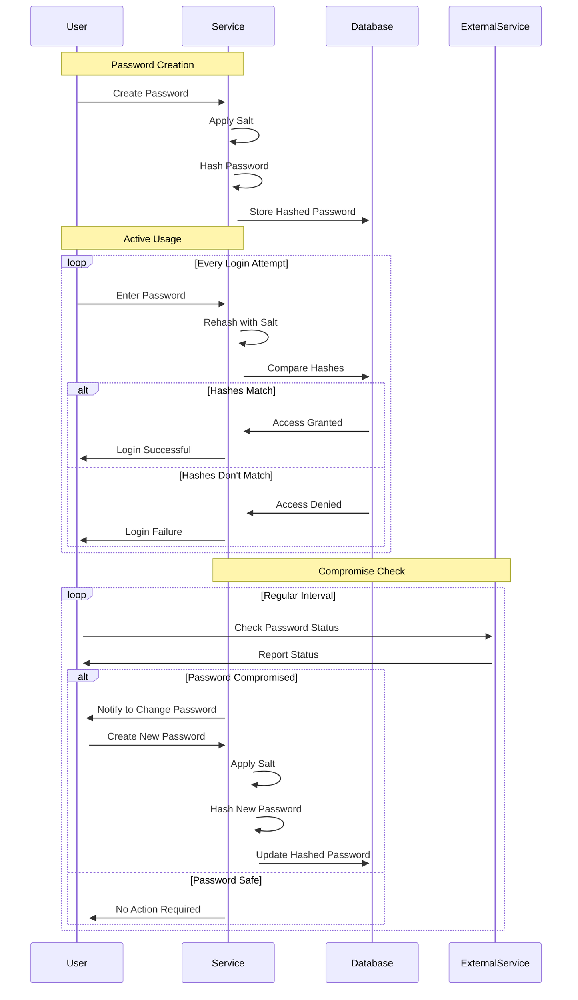
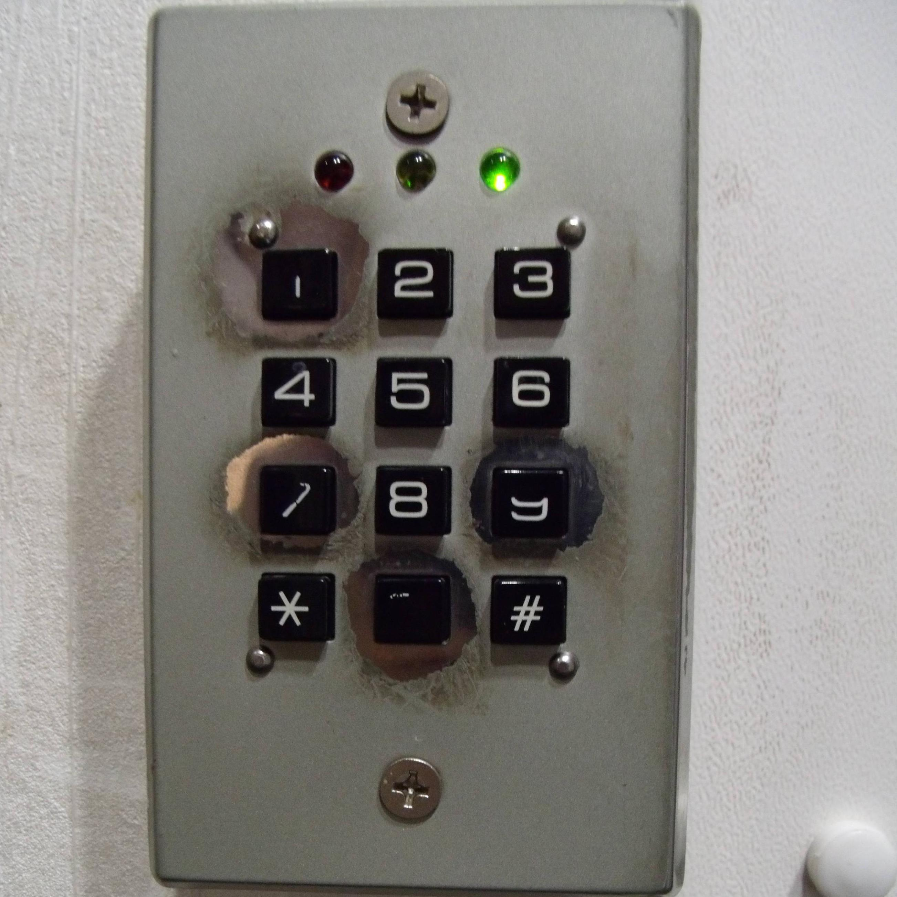

# 2. Password Security

This week, we will explore the concept of information entropy, especially in the context of passwords.
Also, we break some passwords in the process and explore how the breaking could be made a little harder.
Finally, we think about the lifetime of passwords and how to use them more efficiently.

There is also a bonus task if you like to think about the security of one physical keypad.

## Grading

You can obtain up to six points from this exercise if you do the bonus task.

You are not required to do tasks in order, but especially the first one is important.

| Task # | Points | Description |
| ---- | :--: | ---- |
| Task 1 | 1 | The concept of information entropy (Moodle exam) |
| Task 2 | 2 | Practical brute forcing of passwords (Moodle exam) |
| Task 3 | 2 | The lifetime of the password  |
| Task 4 | 1 | Keypad (Bonus task) |

Later tasks will require more time investment when compared to the previous tasks to acquire the relative amount of points. 

# Task 1: The concept of information entropy

*Unpredictability* is the most fundamental concept in cyber security.
Everything relies on it underneath. If you want to keep something confidential, and access-controlled, you usually use a **secret**, that only you and other authorised parties know.

Unpredictability and uncertainty [^1] are the base for secrets. A secret is not good if someone can guess it. If we had a perfect secret, nobody could guess it. Unfortunately, sometimes the perfect secret can be very challenging to create and use in practice. 

So instead, we settle for less. Is the less enough?

We can measure the unpredictability with [Shannon Entropy](http://en.wikipedia.org/wiki/Entropy_(information_theory))[^2] (aka information entropy).
Entropy is a property of _random phenomenons_; a property of the probability distribution of a random phenomenon, as follows:

$H(X) = -\sum_{i=1}^{n} P(x_i) \log_b P(x_i)$, where

- $H(X)$ is the entropy of the random variable $X$.
- $P(x_i)$ represents the probability of occurrence of the $i$-th possible value of $X$.
- The summation is over all $n$ distinct possible values of $X$.
- $\log_b$ is the logarithm of the base $b$, where $b$ is typically 2 (binary logarithm) in the context of information theory, but can be any base depending on the context. With the base 2, the unit of entropy is *bits (or “shannons”).* 

In short, entropy **measures the amount of randomness**.
If the secret has high entropy, the probability distribution will give very little information about the underlying random phenomenon.
You can learn more about information theory from [Khan Academy](https://www.khanacademy.org/computing/computer-science/informationtheory/moderninfotheory/v/information-entropy), for example. 

One of the most common secrets is passwords, which are the focus of this week. Overall, entropy is important in cryptography, but we don't handle that in this course. 
## Task 1A): Entropy and passwords.

The general probability of guessing the password is based on the amount of overall combinations, or *permutations*.
This assumes that you know how the requirements for password generation.
In that case, we can calculate the permutations of the password as follows:
$$
\begin{align*}
\text{Permutations} &= N^L \\
\text{Where:} \\
& N \text{ is the number of possible characters.} \\
& L \text{ is the length of the password.}
\end{align*}
$$

For example, if a password can contain lowercase letters, uppercase letters, numbers, and special characters, the calculation is as follows:

> Let's say there are 26 lowercase letters, 26 uppercase letters, 10 digits, and 10 special characters. The total number of characters $N$ is then 26 + 26 + 10 + 10 = 72.

Entropy calculation of the passwords is similarly based on the length and the probability distribution of the characters. 
Probability distribution depends on the available character set.

If we apply the password permutation calculation for the entropy formula, the total entropy calculation is simplified as follows for *truly randomly generated passwords*: 

$$
\begin{align*}
\text{Entropy} &= L \times \log_2 N \\
\text{Where:} \\
& N \text{ is the number of possible characters. } \\
& L \text{ is the length of the password.}
\end{align*}
$$

If we look at the [Hive Systems password table](https://www.hivesystems.io/blog/are-your-passwords-in-the-green), 

Entropy calculation can be hard to do correctly, i

## Task 1B): Regexes and time.

## Task 2C) Brute forcing against key stretching algorithms

## Task 3: Lifetime of the password

> Return this task to GitHub

Explore the following graph about typical password lifetime.

On high level, it describes about the traditional process when user creates and uses passwords, until there is a need to change it because of the breach.
It also notes some best practices on using the passwords on the systems. 

> Your task is to write an essay of 1-2 A4 pages (400-800 words) about the *best practises of using passwords, implementing password-based systems, and managing the passwords over their lifetime.*

> Consider the following when writing the essay:

 * On task 1, we thought about entropy. Why it is very difficult to measure entropy for human-created passwords?
 * What is the role of using hashes **and salts** in the passwords? Check also [rainbow table attack](https://en.wikipedia.org/wiki/Rainbow_table).
 * Explore state-of-the-art hashing functions.
	 * Why we use key stretching algorithms when we hash passwords?
	 * Consider the importance of resistance of hashing functions in password context (e.g. you do not get benefit for calculating the hashes on graphic card).
* Check services like [';--have i been pwned?](https://haveibeenpwned.com/Passwords). Why are they very important? Why you should never re-use your passwords?
* Consider the dilemma of usability and security in the password context.  Good passwords are typically hard to remember.  Are password managers with automatic breach notifications the solution?

You can also get ideas from the [xkcd comic about password strength](https://imgs.xkcd.com/comics/password_strength_2x.png).

# Task 4: Keypad (bonus task)

You encounter this locked door with this keypad.
You know that this lock model can be configured for 4, 5, 6, or 7-digit key codes.
The lock does not give you any else information during the key code attempt than the success light or fail light after a timeout when any input key is pressed last time. How many attempts do you need to get guaranteed success?

> Either include maths about your result or make a program to compute all the possibilities. Argument your results. Return this task to GitHub. Grading is strict for this task.

Credits for the OUSPG alumni Jukka Pajukangas for originally making this task. 

[^1]: [Uncertainty](https://en.wikipedia.org/wiki/Uncertainty)
[^2]: [Shannon Entropy](http://en.wikipedia.org/wiki/Entropy_(information_theory))