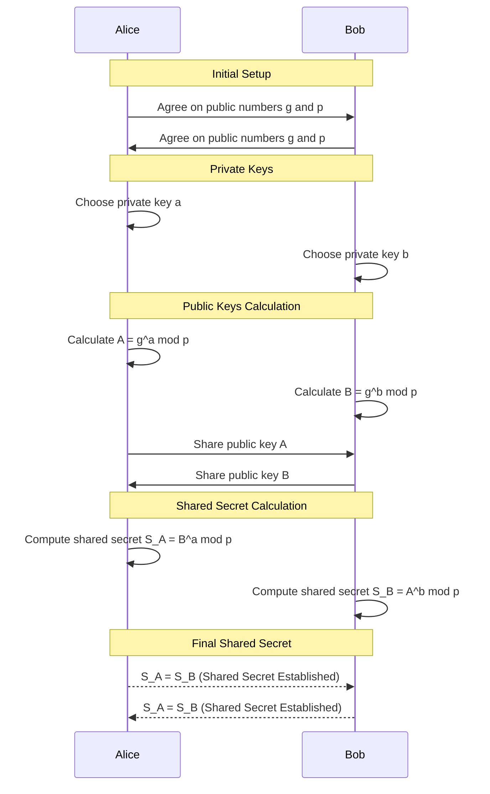
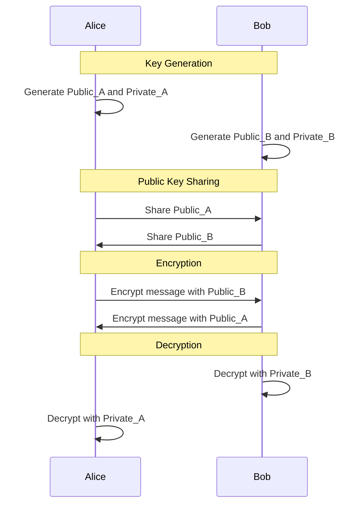

# 3. Messaging Security

In this week, we handle the topics of encryption, trust and digital identity in the context of messaging. 
When we talk about messaging in this exercise, we upgrade the definition for all digital communication and data exchange. 
The similar principles apply also in there.

The first task covers the basics of encryption and public-key cryptography. 
In the second task, we explore a bit about digital entities and trust systems in that context; how is the trust of the web page built.

> The workload is based on the assumption that students will use LLMs!

This exercise covers some very basics of modern cryptography and acts as introduction to the field.
If you would like to know more about the topic, check out the courses **521244S Modern Cryptography (maths)** and **IC00AK18 Cryptographic Systems and Their Weaknesses (technical implementations)**.

## Grading

You can obtain up to five points from this exercise.

You are not required to do tasks in order, but especially the first one is important.

| Task # | Points | Description |
| ---- | :--: | ---- |
| Task 1 | 3 | The concept of computational complexity (Moodle exam) |
| Task 2 | 2 | Digital identity and trust (Return to GitHub) |

Later tasks will require more time investment when compared to the previous tasks to acquire the relative amount of points. 

# Task 1: The concept of computational complexity

Regular passwords (or secrets) alone are not enough to cover all real world requirements of authentication, confidentiality, and integrity.  Especially in the digital messaging context, there are a variety of challenges what we need to consider and solve.

Imagine if you want to send a secret letter to a friend. You put it in a box and lock it with a key. But how do you get the key to your friend without someone else grabbing it first? This is where regular passwords or secrets show their limits. They're like a single key that both locks and unlocks the box. If you share this key, it could fall into the wrong hands. This kind of one-key system is known as a [symmetric-key algorithm](https://en.wikipedia.org/wiki/Symmetric-key_algorithm) because the same key is used on both ends.
We could try to deliver this key on a separate secure line, but that would make the original line impractical, even if we would be somehow able to guarantee the security of another line.
And in that case, why bother with the box?

There are two approaches for solving the previous problem
  * Could it be possible to develop **a secure protocol** where we can share a secret over the same insecure line, with proved security?
  * Or maybe we don't need to share the secret, *at all*.

Currently, known solutions for the both previous approaches are based on the **[concept of computational complexity.](https://en.wikipedia.org/wiki/Computational_complexity)**

 We can make use of **complex problems** which are computationally feasible to perform in [one direction](https://en.wikipedia.org/wiki/One-way_function) (e.g., multiplying large primes) but extremely difficult to reverse (e.g., factoring the product of these primes) without having the secret.
This is the area of modern cryptography; we use [computational hardness assumptions](https://en.wikipedia.org/wiki/Computational_hardness_assumption) as base for secrecy. 
We assume again that systems are secure if *any adversaries are computationally limited*. The security follows the idea of information entropy from the previous week, but well, *it is much more complex*.

Let's consider the second scenario from a complex problem perspective; what if we don't need a secret?
If we continue with the box example, it's like giving your friend an unbreakable box with a special lock. Your friend sends you this box, which anyone can lock, but only your friend (the one who sent it) has the unique key to open it. This means you (who received the box) can send your secret message safely, without ever needing to worry about the key being stolen!

This is called as [public-key (also asymmetric) cryptography](https://en.wikipedia.org/wiki/Public-key_cryptography). In a short, we have **public key** to encrypt the contents and **private key** to decrypt them.  The secrecy is based on computational hardness; it is easy to encrypt with public key, but extremely difficult to decrypt with it, and hence, we require private key to access the contents. 

We only cover one basic example in this course how it works internally, but it is a very important concept on a higher level.

## Task 1A) Key exchange algorithms: Diffie-Hellman

[Diffie-Hellman key exchange](https://en.wikipedia.org/wiki/Diffie%E2%80%93Hellman_key_exchange) was one of the first widely adapted public-key protocols. 
It is based on [the discrete logarithm problem.](https://en.wikipedia.org/wiki/Discrete_logarithm)
And it is still one of the most critical protocols out there; **every [TLS connection](https://en.wikipedia.org/wiki/Transport_Layer_Security) &#128274; from your browser and other places uses it!**

> The protocol *makes possible to exchange shared secret key under the insecure line* with some proved security assumptions, if we select parameters correctly. 

Let's take a look at the original **Finite Field Diffie-Hellman** protocol.  Wikipedia is *very accurate and correct* in cryptography, and you should read that about Diffie-Hellman. Here we have a shortened version.
We don't have to understand all the maths related to the problem for understanding the protocol itself. 

$$
\begin{align*}
 \text{Let the following happen} \\
 \text{with Alice and Bob:} \\
& g \text{ is a publicly shared base and primitive root} \\
& p \text{ is a publicly shared prime number} \\
& a \text{ is Alice's private key} \\
& b \text{ is Bob's private key} \\
\end{align*}
$$

Alice and Bob each choose their private keys, $a$ and $b$, which are kept secret. They compute their public keys as follows:

$$
\begin{flalign*}
\text{Alice's public key:} \quad & A = g^a \mod p \\
\text{Bob's public key:} \quad & B = g^b \mod p
\\\\
 \text{Where:} \\
& A \text{ is Alice's public key.} \\
& B \text{ is Bob's public key.}
\end{flalign*}
$$

After exchanging their public keys, Alice and Bob can compute the shared secret independently:

$$
\begin{align*}
& \text{Shared secret as computed by Alice:} \quad & S_A = B^a \mod p \\
& \text{Shared secret as computed by Bob:} \quad & S_B = A^b \mod p
\end{align*}
$$

The shared secret value depends on the initially chosen secrets, and shared secrets will be equal because of the properties of the modular exponentiation.

$$
{A}^{b}\bmod {p} = {g}^{ab}\bmod {p} = {g}^{ba}\bmod {p} = {B}^{a}\bmod {p} \Rightarrow S_A = S_B
$$

As a result, we get the following sequence diagram. (click me!)

### Task assignment: Brute forcing the private key — **how secret is this secret?**

Let's observe in practice how hard it actually can be to “crack” the private key, even on small numbers. You can do this by simply brute forcing the private key. Iterate all possible numbers based on the group $p$ and see if with some number you are able to get the matching public key. You can assume that private key is smaller than $p -1$.

This means that you need to do a small programming exercise by applying previous equations and guess the private key.
The assignment uses 30-bit length for $p$. 

> [!Tip]
> You will notice, that linear brute forcing process is very slow, and you want to speed up the process, by using [Baby-step giant-step algorithm!](https://en.wikipedia.org/wiki/Baby-step_giant-step) 
> *One might find some existing code pieces to just reuse them or consult a friendly LLM…*
> If you want to go the deep end, [here are](https://math.mit.edu/classes/18.783/2022/LectureNotes9.pdf) some excellent notes (not required).

Since we work on very small numbers (30 bits), it is rather easy to find multiple different private keys which produce the same public key. This highlights the importance of usage of large numbers in Diffie-Hellman.

* The properties of cyclic groups and the behaviour of the modulo operation can lead to situations where multiple different exponents (private keys) result in the same value when raised with a given base $g$ and taken modulo $p$.
* The range of possible keys is significantly limited due to low bit length, and this increases the chances for collisions. 
* The security is based on the probability assumptions of above.
* However, **the shared secrets are always the same because of the properties of modular exponentiation!**

> [!Important]
> On the Moodle exam, you will be provided Diffie-Hellman parameters, excluding the Bob's and Alice's hidden secrets. Brute force the private key, either by using Bob's or Alice's public key, **then calculate the shared secret by using the other public key**. The bit length is intentionally selected so that you might need to consider using “a baby-step giant-step algorithm”.

Correct parameter selection is essential in Diffie-Hellman to get the maximum security. We don't cover that in depth this course, but here is an overview.

$$
\begin{align*}
& \text{Let } p \text{ be a large prime and } g \text{ a primitive root modulo } p. \\
& \text{The private keys } a \text{ (for Alice) and } b \text{ (for Bob) are chosen under the following conditions:}
\end{align*}
$$

$$
\begin{align*}
1.\ & a, b \in \mathbb{Z} \\
2.\ & 1 < a, b < p-1 \\
3.\ & a, b \text{ are chosen randomly and kept secret} \\
\\
\text{Where:} \\
\mathbb{Z} & \text{ denotes the set of all integers.} \\
a, b & \text{ are the private keys of Alice and Bob, respectively.}
\end{align*}
$$

***Minimum*** recommended length for Diffie-Hellman's group prime $p$ is usually 2048 bits.  Sometimes there can be benefits if the prime $p$ is also a safe prime: $p=2q+1$ where $q$ is also prime.  

$\textcolor{red}{\textit{If you manage to solve the discrete logarithm problem in polynomial-time, \textbf{you will break the world.}}}$

If you have ever wondered of the excitement around quantum computers, that is what they potentially [can do.](https://en.wikipedia.org/wiki/Shor's_algorithm)

## Task 1B) Basics of public-key encryption

Diffie-Hellman key-exchange algorithm can be expanded to [ElGamal encryption](https://en.wikipedia.org/wiki/ElGamal_encryption).  
Let's take a look at a simplified explanation of that.

In the context of Diffie-Hellman, each participant often uses public keys only once per exchange to maintain [perfect forward secrecy](https://en.wikipedia.org/wiki/Forward_secrecy).
However, in ElGamal encryption, a key aspect is the introduction of a unique, temporary key for each encryption process. This key is known as the _ephemeral key_, denoted as $k$. 
Typically, only the message sender changes this key, and the receiver's public key stays constant.

The secret $k$ must be changed for each message to _maintain the entropy of the message; it should be truly randomly generated._

Consider a scenario where Bob sends an encrypted message to Alice. The encryption process in `ElGamal` is as follows:

$$
\begin{align*}
S = A^k \mod p \\
C_1 = g^k \mod p \\
C_2 = M \times S \mod p \\
\\
\text{Where:} \\
& S \text{ is shared secret.} \\
& k \text{ is ephemeral key (Bob's hidden secret).} \\
& A \text{ is Alice's public key.} \\
& C_1 \text{ is sender's ephemeral (aka Bob's) public key.} \\
& M \text{ is the message as integer.} \\
& C_2 \text{ is the ciphertext.}
\end{align*}
$$

$C_1$ and $C_2$ will be delivered to Alice, and Alice decrypts the 
content as follows.

$$
\begin{align*}
\text{To decrypt:} \\
 S &= C_1^a \mod p \\
 M &= C_2 \times S^{-1} \mod p \\\\
&\text{Where }a \text{ is Alice's hidden secret and } S^{-1} \text{ is the modular inverse of } S \text{ modulo } p.
\end{align*}
$$

The decryption process effectively cancels out the shared secret, leaving the original message $M$.
The message size must be smaller than $p - 1$. 

The above is simplification; usually $C_1$ is just thought a part of the ciphertext, but when comparing to the Diffie-Hellman, it can be thought as public key. 

> In the Moodle exam, you will get all Diffie-Hellman parameters and ElGamal encrypted message. Decrypt the message by applying the above.
> Covert the resulting integer to hexadecimal and handle it as a hex string. You will get the plaintext message from it.

> [!WARNING]
> The exam parameters are only for educational use. The security depends on the correct generation of the parameters. The original Diffie-Hellman is also vulnerable to [man-in-the-middle attack.](https://en.wikipedia.org/wiki/Man-in-the-middle_attack) 
> 

On high level, with modern public-key algorithms, the encryption sequence can be following. (click me!)

## Task 2: Digital signatures and wannabe Alice's

> Return as Moodle exam

Public-key cryptography is also the foundation of [digital signatures](https://en.wikipedia.org/wiki/Digital_signature). 
Digital signing is used to ensure the _integrity and authenticity of a message_.

We sign data using **private keys**, and validate the signature using **public keys**.

If you ever have wondered how digital signatures in PDFs and other places work, they are also derived from the public-key cryptography.
[If you own an ID card, it has certificate and private key inside](https://dvv.fi/en/citizen-certificate-electronic-signature).

Both integrity and authenticity are achieved by first creating a hash (a fixed-size string of bytes) of the original message, and then signing this hash with the private key. 
Anyone can verify the signature using the correct public key.

When proving the integrity, the message content is hashed, and this hash value is compared to the value obtained from the signature after verifying the signature. The hash ensures that the content is unmodified. If the signature is correctly verified with the public key, it also validates the origin of the message.

### Task assignment

Alice has attempted to send a message for you!

The message is in the “messages” folder. However, there are many *wannabe Alice's* who are not the real and try to confuse and scam you. 
You cannot be sure which message is the correct one.

However, *the real Alice* was smart and she digitally signed her message. Wannabe Alice's have signed their messages too, but they didn't have the correct private key…

Alice has shared her public key with a small twist; it is a QR code. What is the correct message?

> You will get the QR code in Moodle exam. Return the secret part of the message in secret{} format.

All the messages have been signed by using [GnuPG](https://www.gnupg.org/).
GnuPG is based on the [OpenPGP standard,](https://www.openpgp.org/) which was originally created for end-to-end encryption of emails.

On this task, you will need to import Alice's public key to `gpg`.
The course VM has[`gpg`](https://man.archlinux.org/man/gpg.1) pre-installed. 

To read the QR codes, you need to install `zbar`.

`sudo pacman -Sy zbar`

## Task 3: Digital identity and trust

> Return this task to GitHub