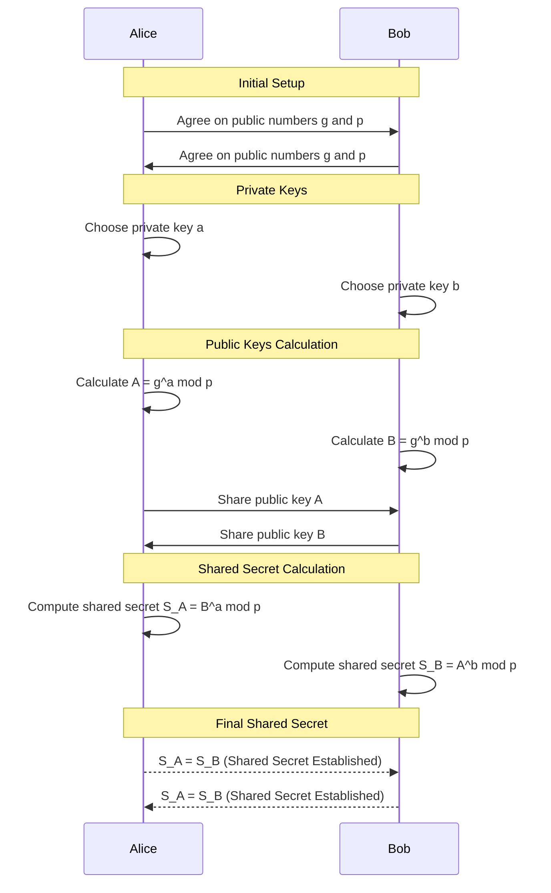
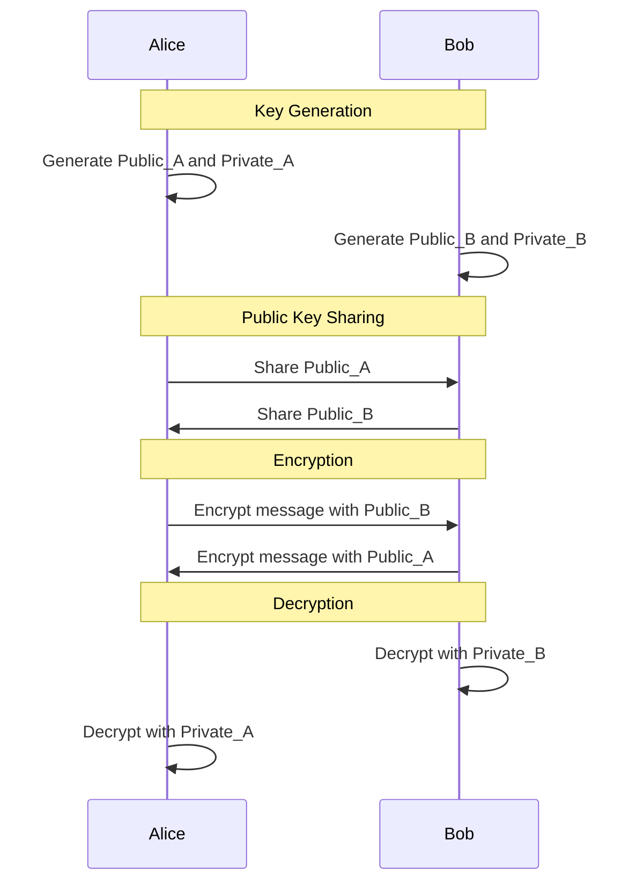

# 3. Messaging Security

In this week, we handle the topics of encryption, trust and digital identity in the context of messaging. 
When we talk about messaging in this exercise, we upgrade the definition for all digital communication and data exchange. 
The similar principles apply also in there.

The first task covers the basics of encryption and public-key cryptography. 
In the second task, we explore a bit about digital entities and trust systems in that context; how is the trust of the web page built.

This exercise covers some very basics of cryptography.
If you would like to know more about the topic, check out the courses **521244S Modern Cryptography (maths)** and **IC00AK18 Cryptographic Systems and Their Weaknesses (technical)**.

## Grading

You can obtain up to five points from this exercise.

You are not required to do tasks in order, but especially the first one is important.

| Task # | Points | Description |
| ---- | :--: | ---- |
| Task 1 | 3 | The concept of computational complexity (Moodle exam) |
| Task 2 | 1 | Digital identity and trust (Moodle exam) |
| Task 3 | 1 | ? |

Later tasks will require more time investment when compared to the previous tasks to acquire the relative amount of points. 

# Task 1: The concept of computational complexity

Regular passwords (or secrets) alone are not enough to cover all real world requirements of authentication, confidentiality, and integrity.  Especially in the digital messaging context, there are a variety of challenges what we need to consider and solve.

Imagine if you want to send a secret letter to a friend. You put it in a box and lock it with a key. But how do you get the key to your friend without someone else grabbing it first? This is where regular passwords or secrets show their limits. They're like a single key that both locks and unlocks the box. If you share this key, it could fall into the wrong hands. This kind of one-key system is known as a [symmetric-key algorithm](https://en.wikipedia.org/wiki/Symmetric-key_algorithm) because the same key is used on both ends.
We could try to deliver this key on a separate secure line, but that would make the original line impractical, even if we would be somehow able to guarantee the security of another line.
And in that case, why bother with the box?

There are two approaches for solving the previous problem
  * Could it be possible to develop **a secure protocol** where we can share a secret over the same insecure line, with proved security?
  * Or maybe we don't need to share the secret, *at all*.

Currently, known solutions for the both previous approaches are based on the **[concept of computational complexity.](https://en.wikipedia.org/wiki/Computational_complexity)**

 We can make use of **complex problems** which are computationally feasible to perform in [one direction](https://en.wikipedia.org/wiki/One-way_function) (e.g., multiplying large primes) but extremely difficult to reverse (e.g., factoring the product of these primes) without having the secret.
This is the area of modern cryptography; we use [computational hardness assumptions](https://en.wikipedia.org/wiki/Computational_hardness_assumption) as base for secrecy. 
We assume again that systems are secure if *any adversaries are computationally limited*. The security follows the idea of information entropy from the previous week, but well, *it is much more complex*.

Let's consider the second scenario from a complex problem perspective; what if we don't need a secret?
If we continue with the box example, it's like giving your friend an unbreakable box with a special lock. Your friend sends you this box, which anyone can lock, but only your friend (the one who sent it) has the unique key to open it. This means you (who received the box) can send your secret message safely, without ever needing to worry about the key being stolen!

This is called as public-key cryptography.  In a short, we have **public key** to encrypt the contents and **private key** to decrypt them.  The secrecy is based on computational hardness; it is easy to encrypt with public key, but extremely difficult to decrypt with it, and hence, we require private key to access the contents. 

We only cover one basic example in this course how it works internally, but it is a very important concept on a higher level.

## Task 1A) Key exchange algorithms: Diffie-Hellman

[Diffie-Hellman key exchange](https://en.wikipedia.org/wiki/Diffie%E2%80%93Hellman_key_exchange) was one of the first widely adapted public-key protocols. 
It is based on [the discrete logarithm problem.](https://en.wikipedia.org/wiki/Discrete_logarithm)
And it is still one of the most critical protocols out there; **every TLS connection &#128274; from your browser and other places uses it!**

> The protocol *makes possible to exchange secret key under the insecure line* with some proved security assumptions, if we select numbers correctly. 

Let's take a look at the original **Finite Field Diffie-Hellman** protocol.  Wikipedia is *very accurate and correct* in cryptography, and you should read that about Diffie-Hellman. Here we have a shortened version.
We don't have to understand all the maths related to the problem for understanding the protocol itself. 

$$
\begin{align*}
 \text{Let the following happen} \\
 \text{with Alice and Bob:} \\
& g \text{ is a publicly shared base} \\
& p \text{ is a publicly shared prime number} \\
& a \text{ is Alice's private key} \\
& b \text{ is Bob's private key} \\
\end{align*}
$$

Alice and Bob each choose their private keys, $a$ and $b$, which are kept secret. They compute their public keys as follows:

$$
\begin{flalign*}
\text{Alice's public key:} \quad & A = g^a \mod p \\
\text{Bob's public key:} \quad & B = g^b \mod p
\\\\
 \text{Where:} \\
& A \text{ is Alice's public key.} \\
& B \text{ is Bob's public key.}
\end{flalign*}
$$

After exchanging their public keys, Alice and Bob can compute the shared secret independently:

$$
\begin{align*}
& \text{Shared secret as computed by Alice:} \quad & S_A = B^a \mod p \\
& \text{Shared secret as computed by Bob:} \quad & S_B = A^b \mod p
\end{align*}
$$

The shared secret value depends on the initially chosen secret, and shared secrets will be equal because of the properties of the modular exponentiation.

$$
{A}^{b}\bmod {p} = {g}^{ab}\bmod {p} = {g}^{ba}\bmod {p} = {B}^{a}\bmod {p} \Rightarrow S_A = S_B
$$

As a result, we get the following sequence diagram. 

## Task assignment

Perfect forward secrecy.

## Public-key encryption

## Digital signatures and wanna-be Alice's

## Task 2: Certificates
