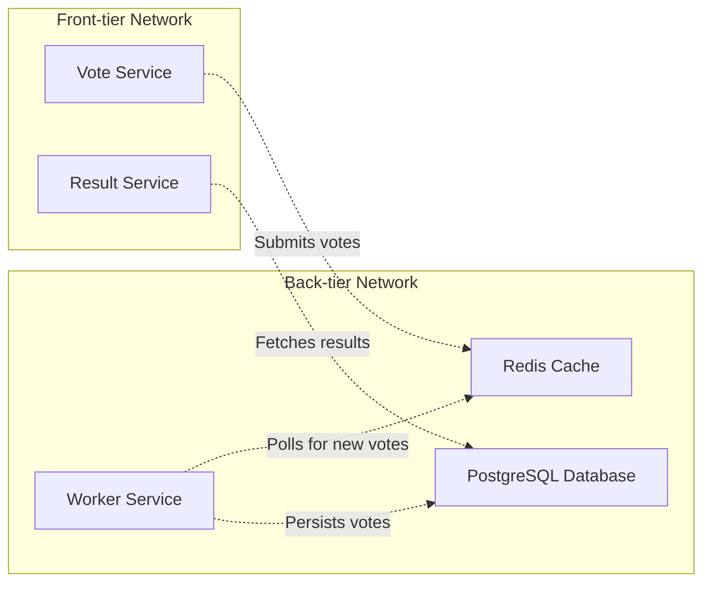
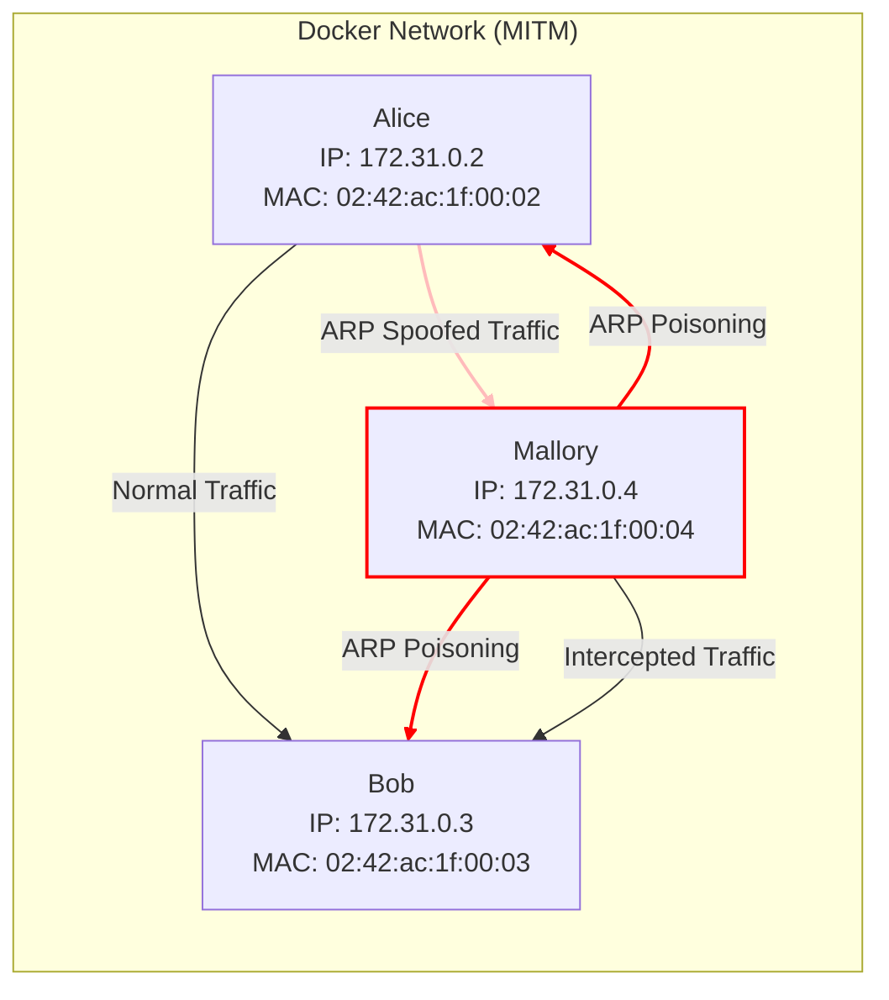

# 3. Network Security

The exercises focus purely on networks and threats in that context.

The first two tasks are about eavesdropping and network analysis. On the third task, we also make an active Man-in-the-Middle attack. 

There are quite many threats in the network context, and we are just taking a brief overview of what they could be.

## Grading

You can obtain up to five points from this exercise.

You are not required to do tasks in order, but it is recommended.

| Task # | Points | Description |
| ---- | :--: | ---- |
| Task 1 | 1 | Basics of packet analysis (Moodle exam) |
| Task 2 | 2 | Network discovery and analysis (GitHub) |
| Task 3 | 2 | ARP poisoning and MitM (GitHub) |

Later tasks will require more time investment when compared to the previous tasks to acquire the relative amount of points. 


## Task 1: Basics of packet analysis

*[Eavesdropping](https://en.wikipedia.org/wiki/Network_eavesdropping)* or *sniffing* is always a risk when we work with networks, and as a result, most of the traffic in these days is encrypted in on some form. 
However, that is not always the case, and sometimes we might also want to analyse, for example, our internal networks also in cyber security testing purposes.

[Wireshark](https://www.wireshark.org/) is the most popular tool for capturing and analysing such packets. 
If you want to go for more programming style, you can, for example, use [scapy](https://scapy.net/) to do the analysis as well.
The course VM has Wireshark pre-installed.

With Wireshark, you can use [display filters](https://wiki.wireshark.org/DisplayFilters) to get a more specific overview of what is happing in the captured traffic in a protocol basis, for example. Look to the wiki [main page](https://wiki.wireshark.org/) for more.

For this task, there is a pre-captured [`.pcap`](https://en.wikipedia.org/wiki/Pcap) file from some LAN network traffic. 
You know that the packet capture includes *an insecure* connection with a login attempt to *the router* with a weak and custom authentication protocol. The authentication may use some sort of *encoding...*

What is the login password?

> In the Moodle exam, you will get link for `.pcap` file. Return the password.

> [!Note]
> Someone might be always be able to see the traffic, even though it is often **illegal to capture the packets you don't own or have permission.**
> In Finland, the Finnish Criminal Code prohibits the unauthorised interception of non-public telecommunications or technical data transfer, as described in [Chapter 38, section 3](https://www.finlex.fi/fi/laki/ajantasa/1889/18890039001#L38). 

## Task 2: Network discovery and analysis

> Return this task to GitHub

On this task, we make a small network analysis exercise by capturing packets by ourselves with Wireshark, and also do some network mapping and service scanning with [`nmap.`](https://nmap.org/)

The target environment is Docker's [Example Voting App](https://github.com/dockersamples/example-voting-app/tree/main).
You should clone this repository, *and navigate to this folder in terminal*.

The course VM has [`docker-compose`](https://docs.docker.com/compose/intro/features-uses/)as pre-installed, which can be used to start virtual networks and multiple services at once, with the help of Docker. 

On the folder, run `docker-compose up` to get started.
It creates all the services and required networks.

The environment has networks and services as follows.


`front-tier` network is external facing; technically that should be accessible by intended users. `back-tier` networks presents internal network, which should be private.
However, in this case, both networks are available for testing purposes.

To get started, you need to run the following commands to get information about the subnets and network interfaces.
Correct network interface information is needed for Wireshark, so you can start capturing traffic from the correct place. Subnets work as starting point to discover the IP address of the services.

**We could look the IP addresses directly from the Docker daemon, but that will spoil the fun with `nmap`!**


```sh
# Network interface is br-<network-id> for the named  Docker network
docker network ls # To see different Docker networks
# To list network interfaces and verify previous
ip addr 
# To get subnet information
docker network inspect <id/name> | jq '.[].IPAM' 
```

> Answer the following questions as part of this task. They also help you to proceed.

### Q1: Getting started with `nmap`

Find out, how you can use `nmap` to discover what hosts are up on the selected subnet. Scan both subnets (`front-tier` and `back-tier`).
*Then scan every host for what ports and services they have, and for other possible fingerprinting information.*

> Return all the commands, their outputs, and briefly explain the results. What IP belongs to which service? Was `nmap` able to identify server information somewhat correctly?

### Q2: Capturing the voting traffic

If you haven't found already, at this point you should know which IP addresses are for voting and result interface, which are accessible by browsers.
*Capture both networks (front, back) with Wireshark*, and play around by casting votes and viewing results. 

> What protocols you can see from the captured data and in which networks?

### Q3: Unique votes?

Somehow, a unique vote is determined. Can you describe, based on the network analysis, *how the unique vote is determined?* What if you are able to intercept this traffic? Or even *spoof* the uniqueness? What this could mean for the voting results.

### Q4: `nmap` aggressive?  

Start capturing `front-tier` network with Wireshark.
Run `nmap -A` to some service in this network. 
Can you spot the traffic it generates? What protocols it uses? What this option is supposed to do? Can it be disturbing for the services?

### Q5: Promiscuous mode?

Wireshark has promiscuous mode.
It can be enabled and disabled from capture → options, and there is a check where it can be enabled and disabled. 
Find out what promiscuous mode does by capturing packets with it being enabled and disabled.
What does promiscuous mode do, and why is it important to have it on when examining network traffic, for example as a network engineer?

## Task 3) ARP poisoning and Man-in-the-Middle Attack (MITM) 

> Return this task to GitHub

What happens if someone is able to alter network routing of unencrypted traffic, and makes *an active Man-in-the-Middle attack*?

Let's try that with practice, by using [Address Resolution Protocol (ARP) cache poisoning](https://en.wikipedia.org/wiki/ARP_spoofing) to alter network routing and further making an traffic-altering proxy.
You can take a look for [video](https://youtu.be/tXzKjtMHgWI) explaining Address Resolution Protocol and another [video](https://youtu.be/A7nih6SANYs) explaining the ARP Poisoning. 

We have once again `docker-compose` environment as follows, where there is one container per entity, with the names and other details are same as parties in the graph.




The graph describes about situation, where Mallory has access to the same network as Alice and Bob. Alice is trying to connect with Bob, but because Mallory has managed to poison ARP cache, all the traffic is routed through Mallory.


We will use following method for simulating: [`curl`](https://curl.se/) command simulates Alice. Bob is running webserver in his IP address, and there is a simple webpage, which will be accessed with `curl`. 


 * To start environment, run `docker-compose up` in this folder.
 * To check that Alice, Bob and Mallory containers are running, run `docker container ls`.
 * To open shell in container, run `docker exec -it <name> bash`, where container name is `alice`, `bob` or `mallory`. `alice` has only `sh` shell. 
 * For example, you can test `alice`'s container, use `curl` in there to query Bob's webpage. This will return: `This is Bob's web server!`.

You can verify the network details again by using `docker network ls` command, and then `inspect` subcommand.

Mallory's container **makes kernel-level port forwarding enabled**; this allows packets to go automatically for the correct destination as Mallory has clean ARP table.


However, this alters the host system and all the containers as well, so it is recommended to verify afterwards that it is disabled after if not using virtual machine, while the change should be only temporal.

Check that `cat /proc/sys/net/ipv4/ip_forward` is non-zero.


**It is useful to capture data from that interface with Wireshark all the time during this exercise, for debugging purposes!**


In Mallory's container, all the source files are automatically mounted to `/data` folder.

### ARP poisoning with [scapy](https://scapy.net/)

We will use `scapy` to send ARP packets to the network.
You will find a template Python script from [src](src) folder.
You need to place IP and MAC addresses correctly and fill the packet sniffing function.


To show local neighbor tables including ARP and NDP (Neighbor Discovery Protocol) entries table status e.g. in Alice's container, run command `ip neigh show`.
You should notice there that routing changes based on the ARP packets.

### Active intercepting with [`mitmproxy`](https://mitmproxy.org/)


Can you use `mitmproxy` to change the Bob's webpage to return `This is not Bob!` for Alice?

Open another shell session with Mallor's container, and modify the sample script from `src` folder. Consult the documentation.

You must modify userspace routing e.g. by using following command, which redirects traffic from 80 port to 8080 for `mitmproxy`. 

```sh
iptables -t nat -A PREROUTING -i eth0 -p tcp --dport 80 -j REDIRECT --to-port 8080
```

> [!Important]
> As a mark of of completion of this task, do the following.

* Submit all the code you have developed/changed for this assignment. 
* Highlight any challenges you encountered and what possible work is missing. Did you learn anything? 
* Provide a screenshot from successful sniffing with `scapy`
* Demonstrate the successful execution of your ARP poisoning and MITM attack, capture the network traffic using Wireshark during the following operations:
  * The ARP spoofing process where you manipulate the ARP tables of the involved devices.
  * The moment you execute a curl request to the target server (Bob) from the victim's machine (Alice).
  * How `mitmproxy` intercepts and modifies the HTTP traffic between Alice and Bob.

Ensure the Wireshark capture (`.pcap` file) is concise and focused on the relevant traffic for easier review.
