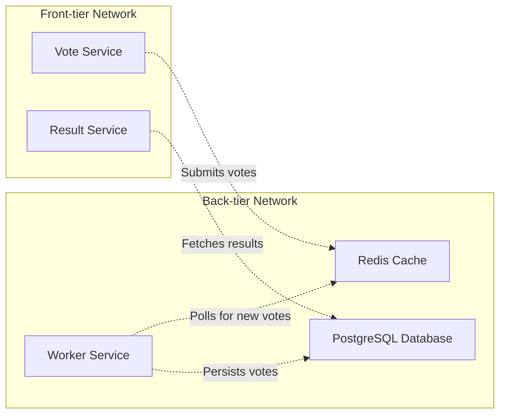

# 3. Network Security

The exercises focus purely on networks and threats in that context.

The first two tasks are about eavesdropping and network analysis. On the third task, we also make an active Man-in-the-Middle attack. 

There are quite many threats in the network context, and we are just taking a brief overview of what they could be.

## Grading

You can obtain up to five points from this exercise.

You are not required to do tasks in order, but it is recommended.

| Task # | Points | Description |
| ---- | :--: | ---- |
| Task 1 | 1 | Basics of packet analysis (Moodle exam) |
| Task 2 | 2 | Network discovery and analysis (GitHub) |
| Task 3 | 2 | ARP poisoning with MitM (GitHub) |

Later tasks will require more time investment when compared to the previous tasks to acquire the relative amount of points. 


## Task 1: Basics of packet analysis

*[Eavesdropping](https://en.wikipedia.org/wiki/Network_eavesdropping)* or *sniffing* is always a risk when we work with networks, and as a result, most of the traffic in these days is encrypted in on some form. 
However, that is not always the case, and sometimes we might also want to analyse, for example, our internal networks also in cyber security testing purposes.

[Wireshark](https://www.wireshark.org/) is the most popular tool for capturing and analysing such packets. 
If you want to go for more programming style, you can, for example, use [scapy](https://scapy.net/) to do the analysis as well.
The course VM has Wireshark pre-installed.

With Wireshark, you can use [display filters](https://wiki.wireshark.org/DisplayFilters) to get a more specific overview of what is happing in the captured traffic in a protocol basis, for example. Look to the wiki [main page](https://wiki.wireshark.org/) for more.

For this task, there is a pre-captured `[.pcap](https://en.wikipedia.org/wiki/Pcap)` file from some LAN network traffic. 
You know that the packet capture includes *an insecure* connection with a login attempt to *the router* with a weak and custom authentication protocol.

What is the login password?

> In the Moodle exam, you will get link for `.pcap` file. Return the password.

> [!Note]
> Someone might be always be able to see the traffic, even though it is often **illegal to capture the packets you don't own or have permission.**
> In Finland, the Finnish Criminal Code prohibits the unauthorised interception of non-public telecommunications or technical data transfer, as described in [Chapter 38, section 3](https://www.finlex.fi/fi/laki/ajantasa/1889/18890039001#L38). 

## Task 2: Network discovery and analysis

> Return this task to GitHub

On this task, we make a small network discovery exercise by capturing packets by ourselves with Wireshark, and also do some network mapping and service scanning with [`nmap.`](https://nmap.org/)

The target environment is Docker's [Example Voting App](https://github.com/dockersamples/example-voting-app/tree/main).
You should clone this repository, *and navigate to this folder in terminal*.

The course VM has [`docker-compose`](https://docs.docker.com/compose/intro/features-uses/)as pre-installed, which can be used to start virtual networks and multiple services at once, with the help of Docker. 

On the folder, run `docker-compose up` to get started.
It creates all the services and required networks.

The environment has networks and services as follows.


`front-tier` network is external facing; technically that should be accessible by intended users. `back-tier` networks presents internal network, which should be private.
However, in this case, both networks are available for testing purposes.

To get started, you need to run the following commands to get information about the subnets and network interfaces.
Correct network interface information is needed for Wireshark, so you can start capturing traffic from the correct place. Subnets work are starting point to discover the IP address of the services.

**We could look the IP addresses directly from the Docker daemon, but that will spoil the fun with `nmap`!**

<details><summary>Command list (click me!)</summary>
```sh
# Network interface is br-<networkid> for the named  Docker network
docker network ls # To see different Docker networks
# To list network interfaces and verify previous
ip addr 
# To get subnet information
docker network inspect <id/name> | jq '.[].IPAM' 
```

</details>

> Answer to the following questions as part of this task. They also help you to proceed.

## Q1: Getting started with `nmap`

Find out, how you can use `nmap` to discover what hosts are up on the selected subnet. Scan both subnets (`front-tier` and `back-tier).
*Then scan every host for what ports and services they have, and for other possible fingerprinting information.*

> Return all the commands, their outputs, and briefly explain the results. What IP belongs to which service? Was `nmap` able to identify server information somewhat correctly?

## Q2: Capturing the voting traffic

If you haven't found already, at this point you should know which IP addresses are for voting and result interface, which are accessible by browsers.
*Capture both networks (front, back) with Wireshark*, and play around by casting votes and viewing results. 

> What protocols you can see from the captured data and in which networks?

## Q3: Unique votes?

Somehow, a unique vote is determined. Can you describe, based on the network analysis, *how the unique vote is determined?* What if you are able to intercept this traffic? Or even *spoof* the uniqueness? What this could mean for the voting results.

## Q4: `nmap` aggressive?  

Start capturing `front-tier` network with Wireshark.
Run `nmap -A` to some service in this network. 
Can you spot the traffic it generates? What protocols it uses? What this option is supposed to do? Can it be disturbing for the services?

## Q5: Promiscuous mode?

Wireshark has promiscuous mode.
It can be enabled and disabled from capture → options, and there is a check where it can be enabled and disabled. 
Find out what promiscuous mode does by capturing packets with it being enabled and disabled.
What does promiscuous mode do, and why is it important to have it on when examining network traffic, for example as a network engineer?

## Task 3) ARP poisoning with MitM 

> Return this task to GitHub