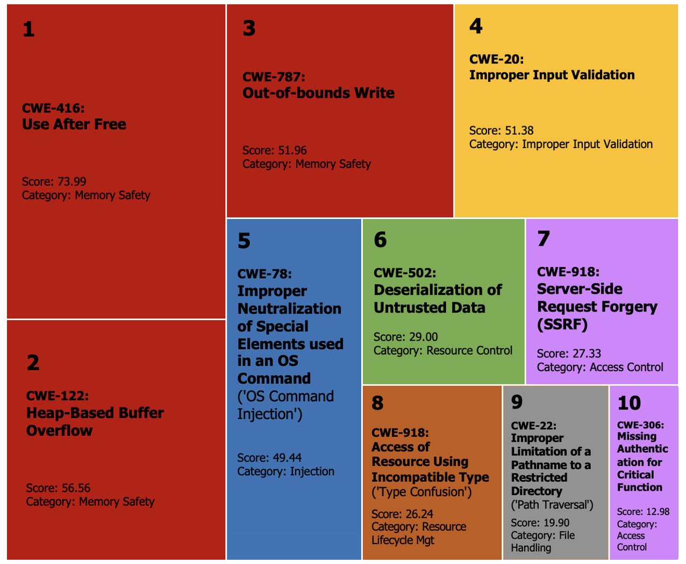
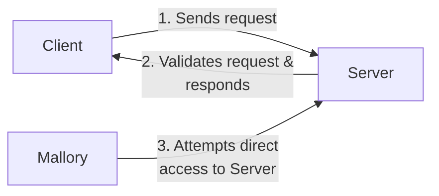
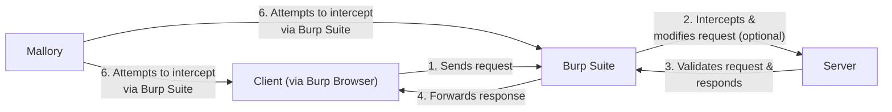

# 5.  Data Input Security

Software faults, errors, or bugs are familiar terms to anyone who has been involved in software development.
These terms typically refer to any condition that prevents a system from performing its required functions. 
Such issues can arise from design faults, implementation errors, or a combination of both, ultimately leading to the same result. [^1]

Sometimes these faults can have more serious consequences than software just “not working”.
There is a specific goal of what software is supposed to do.
Whoever designed and implemented the software, set these goals, maybe based on the strict requirement list.
When designing the software, even the cyber security triad CIA might have come up. 
What if the design or implementation fault compromises some, if not all, of the triad? Or the requirements were just misunderstood?

The **Common Weakness Enumeration** (CWE) is a well-known category system [^2] for these kinds of faults; It especially focuses on faults or *weaknesses* which has an impact on the security of the software or overall systems, and provides a framework for understanding and mitigating potential security risks.

> A “weakness” is a condition in a software, firmware, hardware, or service component that, under certain circumstances, could contribute to the introduction of vulnerabilities. [^5]


We can take a look at CWE's top 25 most dangerous software weaknesses from 2022 [^3] and 2023 [^4], and see that *most of the most dangerous weaknesses are related to data processing of the software, especially to data that can be thought as **input.***


We can further see this by looking into the *Top 10 Known Exploited Vulnerabilities Catalog from 2023*, which was published by the United States' [Cybersecurity and Infrastructure Security Agency (CISA)](https://www.dhs.gov/cisa/cybersecurity-division).
It maps the usage of known exploits to weakness categories and ranks the misuse of the specific weaknesses after the vulnerability in the software has been found. [^5] [^6]

We have more about software-specific vulnerabilities on the final week's exercises.



Memory errors are typically related to input processing, and they are also handled more in the next week.
Their dangers and exploitation of them are handled more in-depth on the course *Cyber Security III: Hardware and Software Security.*

From the image, 4, 5, 6, 8 and 9th are also related in some way to input. 
Typically, the software operates through interfaces. 
Software functions by executing predefined sequences of operations, which are directed through user interfaces or automated inputs. 
The software is designed to follow a specific workflow, branching into different execution paths based on its programming logic.

Inputs act as the initial triggers that activate and guide the software's processes. As the software receives new data through its interfaces, these inputs can alter the course of its operational logic, leading to varied outcomes.
What if some of these inputs are something unexpected?

The type of data a software system can accept and correctly process is determined by its _input validation and sanitisation_ mechanisms. These mechanisms attempt to ensure that only appropriate and safe data is processed, protecting the system from unexpected behaviour or security vulnerabilities.

However, these can fail, as seen above.

## Input validation

Input validation checks if the input meets a specific criterion before accepting it — kind of like a bouncer at a club.

Let's say, we want to validate that program takes **only valid emails as input**. 
It might sound easy, but for example, the 99.99% correct RFC 5322 standard compliant email regex looks like the following [^7].

```none
(?:[a-z0-9!#$%&'*+/=?^_`{|}~-]+(?:\.[a-z0-9!#$%&'*+/=?^_`{|}~-]+)*|"(?:[\x01-\x08\x0b\x0c\x0e-\x1f\x21\x23-\x5b\x5d-\x7f]|\\[\x01-\x09\x0b\x0c\x0e-\x7f])*")@(?:(?:[a-z0-9](?:[a-z0-9-]*[a-z0-9])?\.)+[a-z0-9](?:[a-z0-9-]*[a-z0-9])?|\[(?:(?:25[0-5]|2[0-4][0-9]|[01]?[0-9][0-9]?)\.){3}(?:25[0-5]|2[0-4][0-9]|[01]?[0-9][0-9]?|[a-z0-9-]*[a-z0-9]:(?:[\x01-\x08\x0b\x0c\x0e-\x1f\x21-\x5a\x53-\x7f]|\\[\x01-\x09\x0b\x0c\x0e-\x7f])+)\])
```

Input validation can fail, and if your security depends on the validator which might not be 100% correct, there can be issues.
If the unintended input that bypasses the validator can do something unexpected with the underlying software, you might have introduced a vulnerability.

## Input sanitisation

Input sanitisation, on the other hand, cleans up the input, removing any potentially malicious bits that could cause chaos.

Imagine you have a web application with a form that asks users for their names, which will be displayed on the website.
Without sanitisation, an attacker could enter a script into the name field, like `<script>alert('Hacked!');</script>`.
If unsanitised, this script could execute in the browser of anyone viewing the name, leading to a Cross-Site Scripting (XSS) attack [^8].

To prevent this, input sanitisation would involve stripping out or encoding potentially dangerous characters or strings before they're processed or displayed. For example, you could sanitise the input by converting characters like `<` and `>` into their HTML-encoded equivalents `&lt;` and `&gt;`, rendering the script harmless and preventing it from executing as part of the webpage.

Input sanitisation can also fail, for example, if you do not process every dangerous character, or if there is a way to undo or bypass this process.

## Identifying input-related threats

Whenever the program receives data as input through some interface, *there is always a risk for a vulnerability.*
Is the data processed correctly, noting all possible scenarios?

To effectively identify input-specific threats, one must always consider the final destination and use of the input data within the software's ecosystem; for example, what if it is passed *directly* as a parameter for the shell?

In that case, the environment for the data is shell, and that opens up the possibility for exploitation using shell-supported syntax, allowing attackers to manipulate the input in ways that can trigger unintended actions by the software.
Weakness in this context is usually called as *CWE-78: Improper Neutralization of Special Elements used in an OS Command ('OS Command Injection')* [^9]

If we go even deeper, how is the data passed into the computer's memory? Does it fit for its reserved slot? If it does not, we will have some memory problems. This is historically one of the most dangerous weaknesses; *CWE-787: Out-of-bounds Write*. [^10]

The exercises focus purely on input processing this week, mostly by using manual means for testing it.
In the next week, we will take a look into *fuzzing*, which attempts to automate the process of identifying input-related weaknesses. 

## Grading

You can obtain up to five points from this exercise.

You are not required to do tasks in order, but it is recommended.

All the tasks should be returned to GitHub this week.

| Task # | Points | Description |
| ---- | :--: | ---- |
| Task 1 | 2 | Basics of command injections |
| Task 2 | 1 | Interceptions and SQL injections |
| Task 3 | 2 | Advanced Cross-site Scripting (XSS) |

## Task 1: Basics of command injections

> Return this task to GitHub

Take a look at the sample Python application [ping_service.py](ping_service.py).

It has a [command injection](https://owasp.org/www-community/attacks/Command_Injection) weakness.

Assuming that you have `ping` command and Python on your system, you can run it as

```sh
python ping_service.py 1.1.1.1
```

As a completion of this task, answer the following questions.

### Q1: Find an example command injection that prints the content of `/etc/passwd` file, by just providing input for the sample program.
### Q2: It has potentially two issues which have led injection to be possible. What are they? 

### Q3: How can you fix them?

### Q4: How would you implement either input validation or input sanitisation for this context? What could be better? 

> [!Note]
> *Implement either one of them, or both, and provide the code.* Command-injection should not be possible any more.

### Q5: How can you be sure that injection is not possible anymore?

### Extra: Do the same (and more) with a Damn Vulnerable Web Application (DVWA).

Check the [DVWA repository](https://github.com/digininja/DVWA/tree/master) and clone it.
Run `docker-compose up` on that directory.

Log in as `admin:password`in address `http://localhost:4280`, create the default database and log in again. You will find `ping` command injection from there, but this time with PHP implementation.

On the left, close to the bottom, there is **DVWA Security** section; on there you can change the security level and see how the source code implementation changes for that part.
You must also set this to other than impossible before you can actually make an injection. 
You can adjust the injection difficulty with the same setting (how good is the input validation/sanitisation!).

# Task 2: Interceptions and SQL injections

> Return this task to GitHub

Web-based applications are often exposed to the public internet, and that makes them observable to anyone.  
That also means that the risk for misuse can be higher. 
As a result, we have had increased focus on identifying web-related security issues, and historically we have seen quite many of them.

Typically, these applications are intended to be used by their clients, e.g. mobile apps or just browsers.
These clients connect to the server through different interfaces, possibly using different protocols.
The end-user uses the client based on its user interface.
Overall, this brings us quite many interfaces.

What could go wrong, if your web application does not handle the user or any data input correctly, *on every interface?* Or proper authentication mechanisms are not applied?
What if someone decides *to not use the official clients, while nobody thinks it is normal, like Mallory?*




For this exercise, we explore some of those scenarios, by going to test one quite vulnerable web application, [OWASP's Juice Shop](https://github.com/juice-shop/juice-shop). 
Its documentation is available [here.](https://pwning.owasp-juice.shop/companion-guide/latest/introduction/README.html)

At the same time, we also try out one well-known security testing application, [Burp Suite's Community Edition](https://portswigger.net/burp). 
We mainly use it as an intercepting proxy that sits between the browser and the webserver to intercept and manipulate requests exchange, like the following.



You can also do most of the things just by using browser's developer tools or, for example, [Zed Attack Proxy (ZAP)](https://www.zaproxy.org).

To install Burp Suite on Arch Linux, run

```sh
yay -S burpsuite
```

Take a look at Burp Suite's [documentation](https://portswigger.net/burp/documentation/desktop), especially “Getting Started” section.

> [!Note]
> If you happen to run ARM-based machine, you need to install Burp Suite from the webpage, as the Arch Linux does not bundle the Burp's own browser. On MacBooks, it is better to just use `brew` to install it.


### Getting started with Juice Shop

To start the Juice Shop server from the Docker image, run command

```sh
docker run --rm -p 3000:3000 bkimminich/juice-shop
```

And navigate to `localhost:3000` to explore this shop.
If you already want to start recording all the traffic, you can do this by opening Burp Suite, locating Proxy → Intercept tabs, and opening Burp Suite's built-in browser.

You will see all the HTTP requests on `Target` or `Proxy` tab if you play around with the website at this point. 

### Task 2A) Logging in with SQL injection (0.5p)

Take a look at what is SQL injection weakness CWE-89 [^11] [^12]. 

Juice Shop's login is actually vulnerable for that — the value from the email field is directly passed as part of the SQL command.

Try logging in with random credentials and observe traffic in Burp Suite. Try to trigger an error, based on how SQL syntax works.
You can right-click the request on Burp Suite and send it to “Repeater”, where you can modify and send it easily again.
You can also enable "intercepting": every request from Burp Browser will be paused on Burp before they are delivered to the server.

Once you can trigger the error, check the response for that request. It might reveal quite something interesting.

Now, modify the request so that *your input causes a bypass for the password check on the final SQL command*. As a result, you will log in as the first user.

On Burp Suite, a successful request will return an authentication token, which is actually a [JWT token](https://jwt.io/). Decode it to see, as which user you have logged in.

Neither the client side nor the server side had any kind of input validation.

> Return the input you used in email field to log in.
> Explain your final SQL command.
> Return *decoded* JWT token.

### Task 2B) Hidden products (0.5p)

Take a look at the [Christmas Special Offer](https://pwning.owasp-juice.shop/companion-guide/latest/part2/injection.html#_order_the_christmas_special_offer_of_2014).

The search field has input validation in place this time on the client side, but… there isn't such thing on the server side.

How can you get a list of all products, including the deleted ones?

> Return the input you use in search field to modify the inner SQL command and **also** include JSON data which contains all the products as response.


# Task 3: Advanced Cross-site Scripting (XSS) 

Cross-site Scripting (XSS) is yet another input-related problem, usually related to the lack of input sanitisation.
Take a look at some of its definitions [^8] [^13]. 

In practice, untrusted input data is reflected or directed to the browser in its original format.
If the context is the browser's rendering context, the browser might render the HTML from the input as it is supposed to, or even run JavaScript.

> We continue with the Juice Shop on this task.

As a simple demonstration, you can just put the following input to the Juice Shop's search field:

```html
<iframe src="javascript:alert(`xss`)">
```

That XSS is not persistent, as it just reflects the used search parameter.

XSS can be very dangerous as it can be used to get full control of the current website. 
However, for example, the above XSS uses `iframe` as a base to bypass limitations, and it restricts access for the parent window object by default, as the script is not coming from the same origin.

This limits a bit of what we can do, and we want to do something more, by combining multiple vulnerabilities!


Juice Shop has released its new marketing video at http://localhost:3000/promotion. Viewing the page source or inspecting the traffic with Burp Suite shows you a couple of things:

  1. The video is loaded from http://localhost:3000/video.
  2. Subtitles are embedded on the page itself and they are in WebVTT format.
  3. Subtitles are enclosed in a `<script>` tag.


If you further inspect the traffic with Burp Suite, then you will notice that there is `Content-Location` header on the video's responses, which points to `/assets/` directory with a filename.
If you take this whole path and append it to `localhost:3000`, you will find out that it also loads the video!
If you change the file extension to `.vtt`, you get the subtitles as well, the same subtitles that were embedded in the `<script>` tag.


Would it be possible to modify this subtitle file?

As it happens, Juice Shop has an arbitrary [file upload vulnerability](https://pwning.owasp-juice.shop/companion-guide/latest/appendix/solutions.html#_overwrite_the_legal_information_file).
It includes CWE-22 aka Improper Limitation of a Pathname to a Restricted Directory ('Path Traversal') [^14].
Vulnerability is better known as [Zip Slip](https://security.snyk.io/research/zip-slip-vulnerability).


Your task is to replace this subtitle file so that when the user accessess the promotional page, it loads the script content and does the following: 

1. Use JavaScript to read the cookies of the currently authenticated user
2. Get the authentication token (JWT) from that cookie
3. Parse the JWT token with plain JavaScript to get the current user email *and* hashed password
4. Replace the promotional element new element with the header title "This is Mallory's web page", and show the current user information (email + hashed password)
5. Also, show the profile picture related to that cookie's user.


> [!Tip]
> Use Juice Shop's challenges as help on making this task.
> Check [here](https://pwning.owasp-juice.shop/companion-guide/latest/appendix/solutions.html#_embed_an_xss_payload_into_our_promo_video) about XSS and video.
> Additionally, check [here](https://pwning.owasp-juice.shop/companion-guide/latest/appendix/solutions.html#_overwrite_the_legal_information_file) for file upload vulneralibity.


> [!Tip]
> Go to your's browser's developer tools, and try your script there in console before actually using it as XSS.


> As a mark of completing this task, return all the source code you needed for doing the above, and `zip` file, which uses the path travelsar vulneralibity. Describe shortly what you needed to do. Also, *take a screenshot* from the fresh new promotion page, which shows the credentials of the currently logged user and profile picture.


[^1]: [Software bug](https://en.wikipedia.org/wiki/Software_bug)
[^2]: [Common Weakness Enumeration (CWE)](https://cwe.mitre.org)
[^3]: [2022 CWE Top 25 Most Dangerous Software Weaknesses](https://cwe.mitre.org/top25/archive/2022/2022_cwe_top25.html)
[^4]: [2023 CWE Top 25 Most Dangerous Software Weaknesses](https://cwe.mitre.org/top25/archive/2023/2023_top25_list.html)
[^5]: [2023 CWE Top 10 KEV Weaknesses List Insights](https://cwe.mitre.org/top25/archive/2023/2023_kev_insights.html#)
[^6]: [Known Exploited Vulnerabilities Catalog](https://www.cisa.gov/known-exploited-vulnerabilities-catalog)
[^7]: [Email Address Regular Expression That 99.99% Works.  Disagree?](https://emailregex.com)
[^8]: [Cross Site Scripting](https://owasp.org/www-community/attacks/xss/)
[^9]: [CWE-78: Improper Neutralization of Special Elements used in an OS Command ('OS Command Injection')](https://cwe.mitre.org/data/definitions/78.html)
[^10]: [CWE-787: Out-of-bounds Write](https://cwe.mitre.org/data/definitions/787.html)
[^11]: [CWE-89: Improper Neutralization of Special Elements used in an SQL Command ('SQL Injection')](https://cwe.mitre.org/data/definitions/89.html)
[^12] [SQL Injection](https://owasp.org/www-community/attacks/SQL_Injection)
[^13]: [CWE-79: Improper Neutralization of Input During Web Page Generation ('Cross-site Scripting')](https://cwe.mitre.org/data/definitions/79.html)
[^14]: [CWE-22: Improper Limitation of a Pathname to a Restricted Directory ('Path Traversal')](https://cwe.mitre.org/data/definitions/22.html)