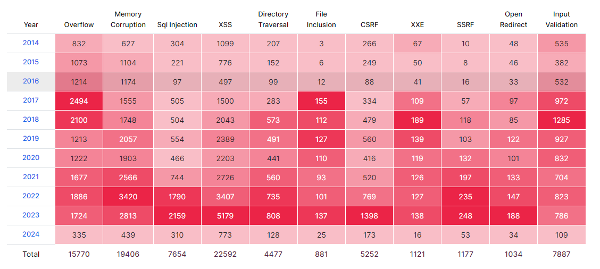

# 7. Vulnerability Assessment

During the course, we have covered different topics that can be thought of as security *weaknesses*, which could result in vulnerabilities in different contexts. 
Especially, the concept of Common Weakness Enumeration (CWE) was handled during the week regarding the data input security.

If we want to prevent known weaknesses and vulnerabilities from happening again or causing an impact on our software, we need to consider different approaches in our software engineering process.
Not only in our threat and risk modeling processes but also during the development and deployment of our products.
Our software is not the only attack vector — all its dependencies are also part of it, better known as [the Software Bill of Materials (SBOM)](#software-bill-of-materials).


What if there is a known vulnerability in the specific software and the specific software version, and we want to share the details about it?
It's essential to document and communicate this information effectively. Such vulnerabilities are typically identified by labels known as CVEs (Common Vulnerabilities and Exposures), which are assigned to particular versions of software to facilitate clear and standardized vulnerability reporting.


Tracking your software dependencies and other information and trying to analyse against known weaknesses is also one form of cyber security testing.
We don't cover much about the secure-by-design aspects of other subjects related to software engineering on this course.

## Software Bill of Materials

How is the software constructed? In the security context, it is important to note *that the software you create is not the only thing to consider*. Especially, as open-source software plays a crucial aspect in modern software development.

The entirety of code, individuals, systems, and processes contributing to the development and delivery of your software constitutes your **software supply chain**. This includes not only the direct code you write but also any external libraries, tools, and services you incorporate [^2] [^3].

While direct dependencies often have the most immediate impact on your software's security posture, the Software Bill of Materials (SBOM) plays a critical role in understanding and managing these dependencies. An SBOM is a comprehensive inventory of all components, both direct and indirect, that are included in your software  [^4].

To assess the current threat to your supply chain, typically the dependency version detection and relevant CVE information have been used as a base.

## Common Vulnerabilities and Exposures (CVE)

**Common vulnerabilities and exposures** or **CVE** are a list of known security threats that are contained to a single database. Each CVE is assigned its own unique ID for identification and documentation. This way, the same security risk can be identified by many organisations or personnel, and possibly mitigated beforehand.

CVEs' documentation provides information about the vulnerabilities. They typically include information as follows.

- Description
- Affected software
- Severity
- Impact

See the official [CVE website](https://www.cve.org/) for more information.

Managing a database of security threats also allows us to find vulnerabilities, prioritise high-priority vulnerabilities and categorise them for example based on attack type (**CWE** in week 5).


Source: [Vulnerabilities By Types/Categories, by CVEdetails](https://www.cvedetails.com/vulnerabilities-by-types.php)
## Grading

| Task # | Points | Description                                                           |
| ------ | :----: | --------------------------------------------------------------------- |
| Task 1 |   2    | Mitigation against known vulneralibities and information leaks (Moodle exam) |
| Task 2 |   1    | Static Program Analysis (GitHub)
| Task 3 |   2    | A tool case study (GitHub)                                            |

## Task 1: Mitigation against known vulnerabilities and information leaks

> Moodle exam

We take a short introduction on how to mitigate some known issues related to known vulnerabilities and sensitive information leaks by using modern tooling.


### Task 1A) SBOM and Dependency Auditing (1p)

The closest dependencies are typically those which are direct software dependencies for your software application.
The second level is the OS-level dependencies, which are, for example, the Linux packages managed by the package manager. These could be used with some means by your software. The third level is the kernel and hardware drivers. If we go even further, there is device firmware and processor microcode. 
The systems can be complex and there are different layers of dependencies and interactions. 

All these dependencies can have vulnerabilities, and depending on the type of vulnerability, they can have a significant effect on the security of the overall system.
For example, [the Log4j incident](https://www.cisa.gov/news-events/news/apache-log4j-vulnerability-guidance) was such a critical case in the past. 


Depending on the chosen or used programming language on the project, the easiness of detecting and analysing the dependencies can vary. An incomplete list of programming-language-specific tools that are meant for *security auditing* their dependencies as an example:

 * In Python, there is a tool [pip-audit](https://github.com/pypa/pip-audit) for scanning Python environments for packages with known vulnerabilities. It uses the [Python Packaging Advisory Database](https://github.com/pypa/advisory-database) as a database for CVEs.
 * On JavaScript, for `npm` package manager, auditing capabilities are [built-in](https://docs.npmjs.com/cli/v10/commands/npm-audit). 
 * On Go, the auditing is also [built-in.](https://go.dev/blog/vuln)
 * For various other languages, you can find many different tools.


 For this task, we try out [Rust programming language](https://www.rust-lang.org/) and its modern tooling.
 From the security engineering perspective, it also provides some secure-by-design philosophies like memory safety, enforced error handling and safe parallelism, in contrast to C and C++ which are notoriously known for their memory problems, while we are not programming here anything this time.

 ### Getting Started with Rust Audit 

We will be looking at a manifest file, which is a file containing metadata about the project, the code files and all the dependencies linked to it. 

It has a crucial role in providing essential information for building and distributing your code. Manifest files can also include checksums of packages to ensure their integrity.

> A manifest file serves as a blueprint for your project. It includes details about dependencies, build configuration, and other project-specific information. For example, in Rust, the `cargo.toml` file acts as the manifest file.

The manifest file we're using in this exercise is Rust programming language's manifest file `Cargo.toml`. 
We will be looking at the packages contained inside the manifest and auditing them for possible vulnerabilities.
For more information, you can look at [the RustSec website.](https://rustsec.org/)


To get started, we need to install Rust:

```sh
sudo pacman -Sy rustup # Rust environment manager
```

```sh
rustup default stable # Change the compiler version to stable
```
Install cargo-audit package manager extension:
```sh
cargo install cargo-audit
```

At this point, we can create a new Rust project! Run 
```sh
cargo new coolproject
``` 
to initialise a new Rust project into `coolproject` folder.

And then run `cargo run` to print `Hello, world!` in `coolproject` folder.
To continue with the task, download the `Cargo.toml` file from Moodle and replace the corresponding file from our `Hello, world!` project.


The auditor needs a proper Rust project to work, but it does not really care about other properties than the dependencies in the manifest file.


To proceed with an audit tutorial, we need to generate a `Cargo.lock` file from the `.toml` file with the following command.

```sh
cargo generate-lockfile
```

`Cargo.toml` does not actually describe the exact, used software dependencies in the project. Instead, it defines requirements that assume some level of stability between software version upgrades, usually following [Semantic Versioning](https://semver.org/). Instead, the `.lock` file tells about the exact used versions in the project.

Normally, the lock file is generated when you run the project, typically from the latest available versions available based on the `SemVer` requirements. With `generate-lockfile`, we initiate this manually and get the exact software versions. 


Finally, we can then scan the `Cargo.lock` file for vulnerabilities with.

```sh
cargo audit
```

> In the Moodle exam, return the name of the package that had a vulnerability. One is enough if there is many. Can you find the CVE from RustSec and the version number where it is fixed?

The process is about the same for other programming languages as well.
A similar idea can be expanded to scanning whole Linux system dependencies or containers, for example, by using tools like [clair](https://github.com/quay/clair).


### Task 1B) Operations Security (OPSEC) (1p)

Operations security (OPSEC) [^1], is a term more commonly known from the military.
It typically means a process that prevents sensitive information from being observed by enemy intelligence, or in generally speaking, from getting into the wrong hands.

This applies also to cyber security; our security is fundamentally based on the **unpredictability** and use of secrets, like passwords or cryptographic private keys.
What if you make a perfectly secure software, but leak all the secrets that are required for deploying and running it in production?

The problem is known to be wide. 
For example, a recent 38 TB data breach from 2023 from Microsoft was a result of [a leaked secret in GitHub](https://www.wiz.io/blog/38-terabytes-of-private-data-accidentally-exposed-by-microsoft-ai-researchers).

Different platforms have adapted secret scanning services, which can be also integrated into CI/CD pipelines, to make it harder to leak secrets during the software development process or secrets ending into the production applications.

For example, GitHub has quite extensive [features](https://docs.github.com/en/code-security/secret-scanning/about-secret-scanning) to mitigate that this would not happen, while it cannot cover all the cases.

What if we take a look at some GitHub repository as an example, which hasn't taken good care of the secrets?

Take a look for a modified instructions repository of this course!

> [https://github.com/CyberSecurityTesting101-2024/CyberSecurityTesting101-secret](https://github.com/CyberSecurityTesting101-2024/CyberSecurityTesting101-secret)

You can, for example, use manual exploration of the content, or use tools like [GitLeaks](https://github.com/gitleaks/gitleaks) to make the process easier.

To install GitLeaks in Arch Linux, run the command `sudo pacman -Sy gitleaks`

If you find some secret, can you use it to access some service?

> In the Moodle exam, you get a name of some friend, which might be useful. Find a flag based on the name as a mark of completion of this task.

## Task 2: Static Program Analysis (1p)

> Return this task to GitHub

With manual inspection and automated testing, like fuzzing, we can identify new weaknesses and *vulnerabilities* in the software.

What if there are specific kinds of weaknesses and resulting vulnerabilities that happen similarly between different applications of the same technology?
At the code level, there might be a specific way of programming to cause bugs, or there might be a common misconfiguration for a system.

Similar thoughts can be also adapted for testing external software about vulnerabilities; does its software with known vulnerabilities or does its code or configuration environment include known mistakes?

Typically, when we have access to the source code of the software, use *static program analysis* methods to identify such issues.
By using different kinds of methods, we try to identify these issues just by analysing the source code.

For this task, we try [`SemGrep`](https://github.com/semgrep/semgrep), a well-known static analysis tool to identify some common programming errors.

You can install it as 
```sh
python -m venv venv && source venv/bin/activate
python -m pip install semgrep
```

And start using it, based on the documentation.
Use it for the previous's weeks [`sample.c`](../6.Fuzzing/sample.c) program, and a week before that, for [`ping_service.py`](../5.DataInputSecurity/ping_service.py).  

> As a completion of this task, provide the outputs of analysis of the both targets. Explain, how well it detected the problem scenarios. Can there be issues on false-positives or false-negatives with these tools? How efficient we can think tools like these to be in theory? If you remember the first week's final task, what do you think based on that?


For more about static analysis tools, check out [the awesome static analysis tools list.](https://github.com/analysis-tools-dev/static-analysis)


## Task 3: A tool case study: improving the software security (2p)
> Return this task to GitHub

Choose one freely available and preferably open-source tool that is primarily marketed for increasing software security. However, when you select a tool, it must be one that has a direct impact on software development or operational deployment. Do not select a product such as a firewall, a VPN, an IDS or antivirus software.

You can also use a tool covered in previous exercises but try to emphasize the software engineering aspects of t. 
It also can be a programming language. Why there is so much talk about *Rust* in these days?  

Once you have selected a tool, read some of its marketing material. Things like feature lists, white papers, user guides, and demo videos would be useful resources. Make note of the arguments that it is being sold on, what it exactly does (“scanning” is a bit too high-level description) and what is the tool expected to deliver.

> What to return

Answer the following questions about where the tool would fit in increasing security in a software project. Please copy each bullet point into your submission and answer directly under that bullet point.

Only a few sentences per bullet point, below, are necessary. However, ensure your own analysis shows through.

- Which tool did you research?
- Which general software development activity would the tool be used in? (E.g., project governance, training, product management, design, implementation, testing, deployment, operations.). Does it map to any SAMM [^11] [^12] activity, and if yes, which one?  
    
- What does the tool, technically speaking, do?
- In that specific area of software development, what does the tool not help with that would still need to be done?
- What types of risks does the tool mitigate?
- What sort of difficulties would you foresee when introducing the tool into a real-world software project - and crucially, _why_ you think you might run into these issues? (Examples of problems could be: Does it need specialists to run; Does it scale into a large organisation; Would it need a lot of work to get into use; Would it be accepted by developers under time pressure; Would it slow down development/integration/testing; Would it require manual work or integrate into the toolchain or automation; Would it fit agile development; and so on.).
- Try the tool in real life (on some real code). Describe how you would include it in a CI/CD pipeline (if applicable)  
    

There is no minimum length; it is when you think you’ve answered the questions sufficiently to convey your own analysis. 500 words should be more than enough for a good answer.

### Grading notes

Your score will depend on how well your analysis targets the last questions. You should aim to answer the ‘why’ part of why you think a certain tool has problems. Just saying what difficulties you foresee, without explaining why, will not achieve a high score.

[^1]: [Operations security](https://en.wikipedia.org/wiki/Operations_security) 
[^2]: [What is software supply chain security?](https://www.redhat.com/en/topics/security/what-is-software-supply-chain-security)
[^3]: [Software supply chain security](https://cloud.google.com/software-supply-chain-security/docs/overview)
[^4]: [Software Bill of Materials (SBOM)](https://www.cisa.gov/sbom)
[^11]: [OWASP SAMM](https://owasp.org/www-project-samm/)
[^12]: [SAMM model overview](https://owaspsamm.org/model/)